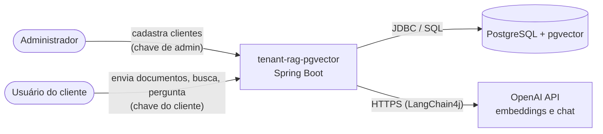
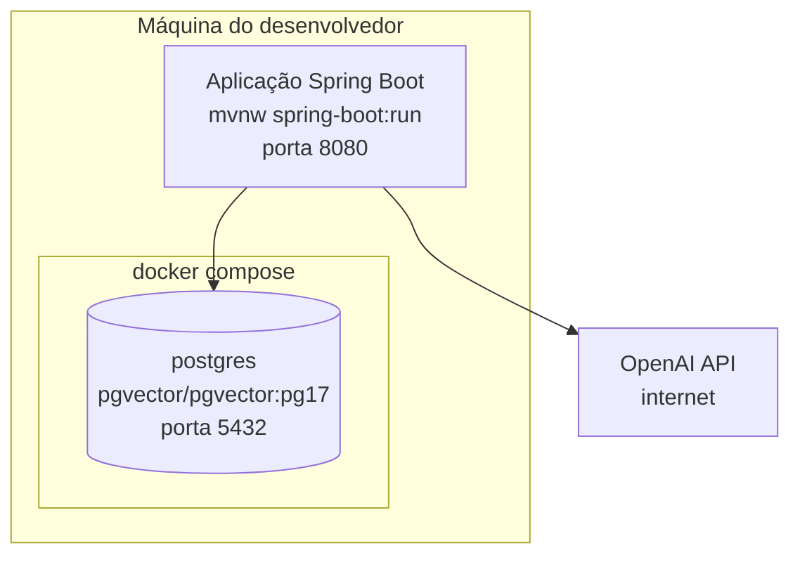
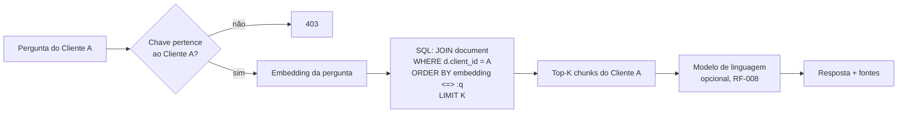

# 01 — Visão geral

## 1. Contexto

Aplicação de estudo de RAG (Retrieval-Augmented Generation) multi-tenant. Cada cliente (tenant) tem documentos de seguro — contrato, aviso de sinistro, relatório de vistoria — que são divididos em chunks, transformados em embeddings e guardados no PostgreSQL com pgvector. Uma pergunta de um cliente recupera os chunks mais parecidos **somente entre os documentos dele** e, opcionalmente, gera uma resposta com um modelo de linguagem.

## 2. Objetivos de arquitetura

Em ordem de prioridade:

1. **Isolamento entre clientes.** Uma consulta do Cliente A nunca devolve dado do Cliente B (README, seção 12). Toda decisão abaixo se subordina a esta.
2. **Clareza didática.** O projeto existe para aprender embeddings, chunking, pgvector, HNSW e RAG (README, seção 11). Preferir código explícito a abstrações que escondem esses conceitos.
3. **Reprodutível na máquina do desenvolvedor.** `docker compose up -d` + `mvnw spring-boot:run`, com a chave da OpenAI em variável de ambiente.
4. **Testável sem rede.** `mvnw test` roda sem chamar a OpenAI.
5. **Mesmo padrão do LangChain.** Usar os conceitos do LangChain (via LangChain4j) que o responsável já estudou em outro projeto.

## 3. Restrições

| Restrição | Origem |
|---|---|
| Java 21, Spring Boot 4.1, Maven | README seção 2, `pom.xml` |
| PostgreSQL + pgvector, Docker Compose | README seções 2 e 4 |
| JUnit e Mockito | README seção 2 |
| Pacote base `br.com.rag_pgvector` (o README diz `br.com.ragpgvector`; vale o código) | `CLAUDE.md` |
| Configuração em `application.properties` (o README mostra `application.yml`) | `CLAUDE.md` |
| Novas tecnologias de IA só quando uma etapa precisar | README seção 2 |
| Filtro por cliente sempre no SQL | README seções 6 e 12 |

## 4. Stack

| Camada | Tecnologia | Decisão |
|---|---|---|
| Linguagem / runtime | Java 21 | README |
| Framework | Spring Boot 4.1 (Spring Framework 7, Hibernate 7) | README |
| Web | Spring Web MVC | README |
| Persistência | Spring Data JPA (clientes e documentos); LangChain4j `PgVectorEmbeddingStore` (chunks e busca vetorial) | ADR-004 |
| Migrations | Flyway | ADR-003 |
| Banco | PostgreSQL 17 + pgvector (imagem `pgvector/pgvector:pg17`) | ADR-002 |
| Framework de IA | LangChain4j 1.20.x (`EmbeddingModel`, `ChatModel`, `EmbeddingStore`, `AiServices`, splitters) | ADR-005 |
| Modelos | OpenAI: `text-embedding-3-small` (768 dim.) e `gpt-4o-mini` | ADR-006 |
| PDF e chunking | LangChain4j `ApachePdfBoxDocumentParser` e `DocumentSplitters.recursive` | ADR-007 |
| Segurança | Spring Security, chave de API por cliente | ADR-008 |
| Erros | `ProblemDetail` (RFC 9457) | ADR-010 |
| Documentação da API | springdoc-openapi 3.1 (OpenAPI 3 + Swagger UI) | ADR-013 |
| Log | SLF4J + Logback do Spring Boot; log por requisição com trace ID (filtro servlet + MDC), sem dependência nova | ADR-015 (em revisão) |
| Testes | JUnit 5, Mockito, MockMvc, Testcontainers | ADR-012 |

## 5. Visão de contexto

## 6. Visão de contêineres (execução local)

- A aplicação roda fora do Docker durante o desenvolvimento (README, seção 4).
- Só o banco fica no `docker-compose.yml`, com volume para os dados.
- Os modelos rodam na OpenAI; a aplicação precisa de internet e de `OPENAI_API_KEY`.

## 7. Ideia central em uma figura

As três camadas da regra de segurança do README aparecem na figura: **controle de acesso** (chave), **filtro de tenant** (SQL) e **similaridade semântica** (`<=>`). O detalhe está em [07 Seguranca e isolamento.md](07%20Seguranca%20e%20isolamento.md).

## 8. Fora do escopo

- Interface web; o acesso é só pela API REST.
- Exclusão e edição de clientes e documentos.
- Formatos além de PDF; OCR de PDF escaneado.
- Deploy em nuvem, multi-instância.
- Observabilidade avançada: métricas, tracing distribuído (propagação de contexto entre serviços, `traceparent`), exportação para ferramentas externas e painéis. **Está no escopo** só o log básico por requisição do RF-013 — uma linha por chamada com método, endpoint, status, cliente, duração e trace ID, e o mesmo trace ID nas demais linhas de log da requisição (ADR-015, em revisão).
- Login de usuários finais; a identidade é o cliente, representado pela chave de API.
