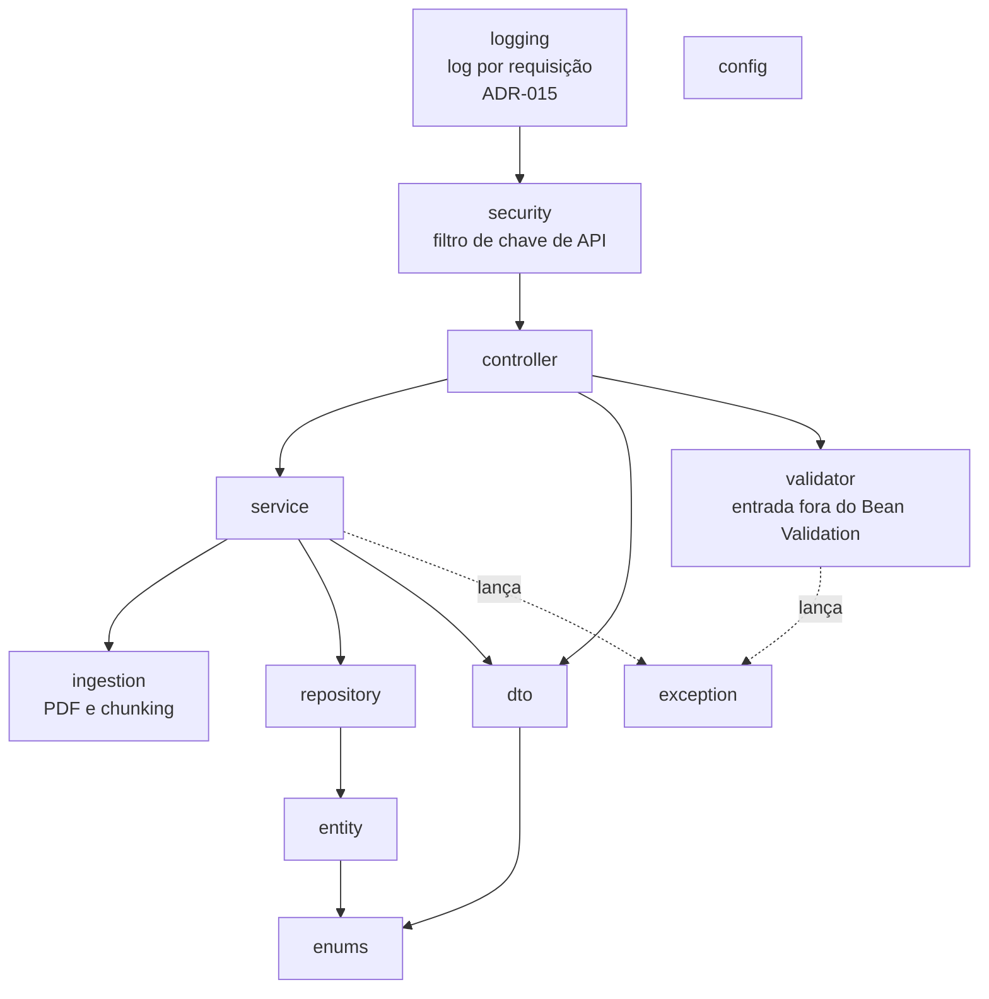

# 02 — Componentes e camadas

## 1. Camadas e regra de dependência



Regras:

- `controller` só fala com `service`, `dto` e `validator`. Nunca acessa `repository` nem devolve `entity`.
- `validator` reúne as validações de entrada que não cabem em Bean Validation (ex.: o `MultipartFile` do upload). Não acessa `service`, `repository` nem banco; só lança exceções do pacote `exception` (ADR-014).
- Erros de negócio e de entrada são exceções próprias do pacote `exception`, mapeadas no `GlobalExceptionHandler`. O código **não usa** `ResponseStatusException` (ADR-014).
- `service` contém a regra de negócio e as transações. Recebe e devolve DTOs ou tipos simples para o controller.
- `repository` só acessa o banco. É o **único** lugar onde existe SQL.
- `entity` não conhece nenhuma outra camada, exceto `enums`.
- `enums` não depende de nada; pode ser usado por `entity`, `dto`, `service` e `controller`.
- `ingestion` é Java puro (sem Spring Data, sem HTTP), fácil de testar isolado.
- O `clientId` atravessa todas as camadas como parâmetro explícito; não existe "cliente atual" escondido em variável estática ou `ThreadLocal` dentro de service ou repository.
- `logging` (ADR-015) só envolve a requisição: não chama `controller`, `service` nem `repository`, não lê cabeçalhos nem corpo e só coloca o `traceId` no MDC do SLF4J. O MDC serve apenas para o log; nenhuma regra de negócio lê valores dele (a regra do `clientId` explícito acima continua valendo).

## 2. Estrutura de pacotes

Base: `br.com.rag_pgvector`. Itens marcados com **(novo)** não estão na estrutura do README; o motivo está na coluna "Observação".

```text
br/com/rag_pgvector/
├── TenantRagPgvectorApplication.java
├── config/
│   ├── AiConfig.java
│   ├── OpenApiConfig.java            (novo)
│   ├── OpenAiProperties.java         (novo)
│   ├── RagProperties.java            (novo)
│   └── SecurityConfig.java           (novo)
├── controller/
│   ├── ClientController.java         (novo)
│   ├── DocumentController.java
│   ├── SearchController.java
│   └── AnswerController.java         (novo)
├── service/
│   ├── ClientService.java            (novo)
│   ├── DocumentService.java
│   ├── DocumentWriter.java           (novo)
│   ├── EmbeddingService.java
│   ├── SearchService.java
│   ├── AnswerService.java            (novo)
│   └── RagAssistant.java             (novo; interface do AiServices)
├── validator/                        (novo; ADR-014)
│   └── DocumentFileValidator.java
├── ingestion/                        (novo)
│   ├── PdfTextExtractor.java
│   ├── TextChunker.java
│   └── Chunk.java
├── repository/
│   ├── ClientRepository.java         (novo)
│   ├── DocumentRepository.java
│   └── ChunkRepository.java          (usa o PgVectorEmbeddingStore)
├── entity/
│   ├── ClientEntity.java
│   └── DocumentEntity.java
├── enums/                            (novo)
│   └── DocumentTypeEnum.java
├── dto/
│   ├── CreateClientRequestDTO.java, ClientCreatedResponseDTO.java, ClientResponseDTO.java  (novos)
│   ├── DocumentResponseDTO.java
│   ├── SearchRequestDTO.java, SearchResponseDTO.java, SearchResultDTO.java
│   └── AskRequestDTO.java, AnswerResponseDTO.java, SourceResponseDTO.java                   (novos)
├── exception/
│   ├── ResourceNotFoundException.java
│   ├── InvalidDocumentException.java (novo)
│   ├── InvalidFileException.java     (novo; ADR-014)
│   ├── AiProviderException.java      (novo)
│   └── GlobalExceptionHandler.java
├── logging/                          (novo; ADR-015 — ainda não implementado)
│   └── RequestLoggingFilter.java
└── security/                         (novo)
    ├── ApiKeyAuthenticationFilter.java
    ├── ApiKeyHasher.java
    ├── ClientPrincipal.java
    └── ClientAccessAuthorizationManager.java
```

`DatabaseConfig` (citado no README) **não é criado**: o Spring Boot configura `DataSource`, JPA e Flyway sozinho a partir de `application.properties`, e o `PgVectorEmbeddingStore` é montado em `AiConfig`. Crie a classe só se surgir configuração que não caiba nesses lugares.

`DocumentChunkEntity` (citado no README) **não é criado**: os chunks são `TextSegment` do LangChain4j, gravados e lidos pelo `PgVectorEmbeddingStore` na tabela `document_chunk` (ADR-004). Não há entidade JPA para essa tabela.

## 3. Componentes

### 3.1 config

| Componente | Responsabilidade |
|---|---|
| `AiConfig` | Cria os beans do LangChain4j (ADR-005): `EmbeddingModel` (`OpenAiEmbeddingModel`, 768 dimensões), `ChatModel` (`OpenAiChatModel`), `EmbeddingStore<TextSegment>` (`PgVectorEmbeddingStore` em `COLUMN_PER_KEY`, sobre o `DataSource` envolvido em `TransactionAwareDataSourceProxy`) e `RagAssistant` (`AiServices.create(...)`). Código em [06](06%20Integracoes%20e%20configuracao.md), seção 3. |
| `OpenApiConfig` | Metadados da API (título, versão) e esquema de segurança `apiKey` (cabeçalho `X-API-Key`) aplicado a todas as operações, para o botão **Authorize** do Swagger UI (ADR-013). |
| `RagProperties` | `@ConfigurationProperties("app.rag")`: `chunkSize`, `chunkOverlap`, `defaultTopK`, `answerTopK`, `maxTopK`, `embeddingDimension`. Validado com `@Validated`. |
| `OpenAiProperties` | `@ConfigurationProperties("app.openai")`: `apiKey`, `embeddingModel`, `chatModel`, `temperature`. |
| `SecurityConfig` | `SecurityFilterChain` stateless, registra `ApiKeyAuthenticationFilter`, regras de rota (ADR-008), libera as rotas do Swagger (ADR-013) e devolve 401/403 em `ProblemDetail`. |

### 3.2 controller

| Componente | Endpoint | RF |
|---|---|---|
| `ClientController` | `POST /clients`, `GET /clients/{clientId}` | RF-003 |
| `DocumentController` | `POST /clients/{clientId}/documents` (multipart) | RF-006 |
| `SearchController` | `POST /clients/{clientId}/search` | RF-007 |
| `AnswerController` | `POST /clients/{clientId}/ask` | RF-008 |

Controllers validam o formato da entrada (`@Valid`; o que não cabe em Bean Validation fica num componente do pacote `validator`, seção 3.2.1), chamam um service e montam a resposta HTTP. Contrato completo em [05 API REST.md](05%20API%20REST.md).

Os controllers ficam acessíveis pelo **Swagger UI** em `http://localhost:8080/swagger-ui.html` (ADR-013). Cada controller leva `@Tag` e cada método `@Operation` e `@ApiResponse` com os códigos de erro possíveis. O `DocumentController` declara `consumes = MediaType.MULTIPART_FORM_DATA_VALUE` e recebe `@RequestPart("file") MultipartFile`, para o Swagger UI mostrar o seletor de arquivo.

### 3.2.1 validator

Pacote `br.com.rag_pgvector.validator` (ADR-014). Componentes `@Component` injetados no controller, para validações de entrada que não cabem em Bean Validation. Sem estado, sem acesso a banco ou a services; em caso de erro lançam exceção do pacote `exception`.

| Componente | Usado por | Responsabilidade |
|---|---|---|
| `DocumentFileValidator` | `DocumentController` | `String validate(MultipartFile file)`: confere o arquivo do upload e devolve o nome limpo (`StringUtils.getFilename(StringUtils.cleanPath(...))`). Regras, na ordem, todas com `InvalidFileException` (400): arquivo vazio → "O arquivo enviado está vazio."; nome ausente → "Informe o nome do arquivo."; nome com mais de 255 caracteres (tamanho de `document.file_name`) → "O nome do arquivo deve ter no máximo 255 caracteres."; nem content-type `application/pdf` nem extensão `.pdf` → "O arquivo deve ser um PDF.". |

O `documentType` continua validado pelo Spring (conversão para `DocumentTypeEnum`, 400), e o conteúdo do PDF continua com o `PdfTextExtractor` (`InvalidDocumentException`, 422).

### 3.3 service

| Componente | Responsabilidade | Transação |
|---|---|---|
| `ClientService` | Cria cliente, gera a chave de API, grava só o hash; busca cliente por id (`ResourceNotFoundException` se não existe). | `@Transactional` |
| `DocumentService` | Orquestra a ingestão: extrai texto → divide em chunks → gera embeddings em lote → chama `DocumentWriter`. | **Sem** transação (ver nota) |
| `DocumentWriter` | Grava o `DocumentEntity` (JPA) e chama `ChunkRepository.saveAll(...)` para os chunks, na mesma transação. | `@Transactional` |
| `EmbeddingService` | Fachada sobre o `EmbeddingModel` do LangChain4j: `Embedding embedQuery(String)` e `List<Embedding> embedDocuments(List<TextSegment>)` (uma chamada para o lote). Valida texto vazio e dimensão; converte erros da OpenAI em `AiProviderException`. Nos testes, o `EmbeddingModel` é um fake determinístico. | — |
| `SearchService` | Gera embedding da pergunta, limita `topK`, chama `ChunkRepository.searchByClient(...)` e converte os `EmbeddingMatch` em `SearchResultDTO`. | Sem transação; a transação curta fica no repository (ver 04, seção 5) |
| `AnswerService` | Chama `SearchService`; se não houver chunks, responde sem chamar o modelo; senão monta o contexto numerado e chama o `RagAssistant`; devolve resposta e fontes. | — |
| `RagAssistant` | Interface do `AiServices` do LangChain4j com `@SystemMessage` (regras do RAG) e `@UserMessage` (trechos + pergunta). Sem `ContentRetriever`: recebe os trechos já filtrados por cliente (ADR-011). | — |

**Nota sobre a transação da ingestão.** Gerar embeddings pode levar segundos. Se `DocumentService` inteiro fosse `@Transactional`, uma conexão do banco ficaria presa durante as chamadas à OpenAI. Por isso o trabalho lento acontece antes, fora de transação, e só a gravação fica dentro de `DocumentWriter`. A regra "tudo ou nada" do RF-006 continua valendo: se qualquer embedding falhar, nada chegou a ser gravado; se a gravação falhar, a transação desfaz tudo. `DocumentWriter` é um bean separado porque `@Transactional` não funciona em chamada de método da própria classe.

O `PgVectorEmbeddingStore` pega conexões direto do `DataSource`. Para que o INSERT dos chunks entre na transação do JPA, o store recebe o `DataSource` envolvido em `TransactionAwareDataSourceProxy`. O teste de integração da ingestão (RF-006 CA-04) confirma o rollback; se ele falhar com uma versão nova da biblioteca, o plano B é apagar o documento numa compensação (`catch` → `DocumentRepository.delete`).

### 3.4 ingestion

| Componente | Responsabilidade |
|---|---|
| `PdfTextExtractor` | `String extract(InputStream)` com o `ApachePdfBoxDocumentParser` do LangChain4j. Lança `InvalidDocumentException` se o PDF for ilegível ou não tiver texto. |
| `TextChunker` | `List<Chunk> split(String text)` com `DocumentSplitters.recursive(chunkSize, chunkOverlap)` do LangChain4j; descarta trechos vazios e numera a partir de 0 (ADR-007). |
| `Chunk` | `record Chunk(int index, String content)`. |

### 3.5 repository

| Componente | Tipo | Responsabilidade |
|---|---|---|
| `ClientRepository` | `JpaRepository<ClientEntity, Long>` | CRUD de cliente; `Optional<ClientEntity> findByApiKeyHash(String)`. |
| `DocumentRepository` | `JpaRepository<DocumentEntity, Long>` | Gravação de documento. |
| `ChunkRepository` | `@Repository` sobre `EmbeddingStore<TextSegment>` (`PgVectorEmbeddingStore`) | `saveAll(clientId, document, chunks, embeddings)`: monta os `TextSegment` com metadados `client_id`, `document_id`, `chunk_index`, `document_type`, `file_name` e chama `addAll`. `searchByClient(clientId, queryEmbedding, topK)`: `EmbeddingSearchRequest` com `filter(metadataKey("client_id").isEqualTo(clientId))` (ADR-004; detalhe em [04](04%20Modelo%20de%20dados.md), seção 5). |

A assinatura de `searchByClient` **exige** `clientId`, e o filtro é montado dentro do repository. Só o `ChunkRepository` acessa o `EmbeddingStore`; nenhum service o injeta.

### 3.6 entity

| Entidade | Tabela | Observação |
|---|---|---|
| `ClientEntity` | `client` | `id`, `name`, `apiKeyHash`, `createdAt` |
| `DocumentEntity` | `document` | `@ManyToOne(fetch = LAZY) ClientEntity client`; `@Enumerated(STRING) DocumentTypeEnum documentType` |
| — | `document_chunk` | Sem entidade JPA: tabela do `PgVectorEmbeddingStore`, acessada só pelo `ChunkRepository` |

Mapeamento detalhado em [04 Modelo de dados.md](04%20Modelo%20de%20dados.md).

### 3.6.1 enums

Pacote `br.com.rag_pgvector.enums`. Reúne os conjuntos fechados de valores usados por entidades, DTOs e regras de negócio.

| Enum | Valores | Usado em | Origem |
|---|---|---|---|
| `DocumentTypeEnum` | `CONTRACT`, `CLAIM`, `INSPECTION` | `DocumentEntity.documentType` (gravado como texto em `document.document_type`), metadado `document_type` dos chunks, parâmetro `documentType` do upload, `DocumentResponseDTO`, `SearchResultDTO`, `SourceResponseDTO` | README seção 5; RF-002 DP-02 |

```java
package br.com.rag_pgvector.enums;

public enum DocumentTypeEnum {
    CONTRACT,
    CLAIM,
    INSPECTION
}
```

- Os valores do enum são iguais aos do `CHECK` da tabela `document` (04, seção 3). Novo valor exige alterar os dois: enum e nova migration.
- Na API, o valor trafega como texto (`"CONTRACT"`); valor desconhecido → 400.

### 3.7 exception

| Exceção | HTTP | Quando |
|---|---|---|
| `ResourceNotFoundException` | 404 | Cliente inexistente em `GET /clients/{id}` chamado pelo administrador. Nas rotas de dados, a segurança já garante que o cliente existe (a chave dele foi encontrada no banco), então um `clientId` alheio dá 403 antes de qualquer consulta (ver 05, seção 3) |
| `InvalidFileException` | 400 | Arquivo do upload vazio, sem nome, com nome acima de 255 caracteres ou que não é PDF (lançada pelo `DocumentFileValidator`; ADR-014) |
| `InvalidDocumentException` | 422 | PDF ilegível ou sem texto |
| `AiProviderException` | 503 | OpenAI indisponível, chave inválida, limite de uso, dimensão errada |
| validação (`MethodArgumentNotValidException`, multipart) | 400 / 413 | Entrada inválida, arquivo grande demais |

`GlobalExceptionHandler` estende `ResponseEntityExceptionHandler` e devolve `ProblemDetail` (ADR-010). Cada exceção própria tem um `@ExceptionHandler` explícito; `InvalidFileException` gera o mesmo corpo dos demais 400 (`type` `about:blank`, `title` "Requisição inválida", `detail` = mensagem da exceção).

Regra (ADR-014): o código não usa `ResponseStatusException`. Erro novo de negócio ou de entrada → exceção própria neste pacote (sufixo `Exception`) + handler no `GlobalExceptionHandler`. `InvalidFileException` (400, problema no envio) e `InvalidDocumentException` (422, PDF recebido mas não processável) são exceções distintas e não devem ser reaproveitadas uma no lugar da outra.

### 3.8 security

| Componente | Responsabilidade |
|---|---|
| `ApiKeyAuthenticationFilter` | Lê o cabeçalho `X-API-Key`, calcula o hash e resolve: chave de administrador → papel `ADMIN`; chave de cliente → `ClientPrincipal(clientId)` com papel `CLIENT`. |
| `ApiKeyHasher` | SHA-256 em hexadecimal da chave. |
| `ClientPrincipal` | `record ClientPrincipal(long clientId)`. |
| `ClientAccessAuthorizationManager` | Autoriza `/clients/{clientId}/**` só se o `clientId` do caminho for o do principal. |

Detalhe em [07 Seguranca e isolamento.md](07%20Seguranca%20e%20isolamento.md).

### 3.9 logging (ADR-015)

Pacote `br.com.rag_pgvector.logging`, para o RF-013 (ADR-015 e decisões DP-01 a DP-07 do RF-013 aprovadas em 2026-10-06). Ainda não implementado; é criado na Etapa 8 do [plano](09%20Plano%20de%20implementacao.md).

| Componente | Responsabilidade |
|---|---|
| `RequestLoggingFilter` | `OncePerRequestFilter`, `@Component` com `@Order(Ordered.HIGHEST_PRECEDENCE + 10)` — antes da cadeia do Spring Security (ordem `-100`), para registrar também 401/403. Gera o trace ID, coloca em `MDC` (`traceId`), devolve no cabeçalho `X-Trace-Id`, mede a duração e, no `finally`, escreve uma linha `service=… environment=… method=… endpoint=… status=… clientId=… traceId=… duration=…ms` com nível conforme o status; remove o `traceId` do MDC. `endpoint` é o caminho sem query string; `clientId` é o número de `/clients/{clientId}` ou `-`. Ignora `/swagger-ui*` e `/v3/api-docs*`. Não lê cabeçalhos nem corpo. Esboço e alternativas na ADR-015. |

O trace ID chega às demais linhas de log (por exemplo, o `log.error` do `GlobalExceptionHandler`) pela propriedade `logging.pattern.correlation` ([06](06%20Integracoes%20e%20configuracao.md), seção 9), sem mudar o `GlobalExceptionHandler`.

## 4. Convenções de código

### 4.1 Sufixos de nome

| Tipo | Sufixo | Exemplos |
|---|---|---|
| Entidade JPA | `Entity` | `ClientEntity`, `DocumentEntity` |
| DTO de entrada | `RequestDTO` | `CreateClientRequestDTO`, `SearchRequestDTO`, `AskRequestDTO` |
| DTO de saída | `ResponseDTO` | `ClientResponseDTO`, `DocumentResponseDTO`, `SearchResponseDTO`, `AnswerResponseDTO` |
| DTO interno ou item de lista | `DTO` | `SearchResultDTO`, `SourceResponseDTO` |
| Controller, Service, Repository | `Controller`, `Service`, `Repository` | `SearchController`, `SearchService`, `ChunkRepository` |
| Exceção | `Exception` | `ResourceNotFoundException`, `InvalidFileException` |
| Validador de entrada | `Validator` | `DocumentFileValidator` |
| Filtro servlet | `Filter` | `ApiKeyAuthenticationFilter`, `RequestLoggingFilter` (ADR-015) |
| Enum | `Enum` | `DocumentTypeEnum` |

- Enums ficam no pacote `enums` (seção 3.6.1), nunca dentro de `entity` ou `dto`.
- Toda entidade declara `@Table(name = "...")` com o nome da tabela do banco (`client`, `document`, `document_chunk`), porque o nome da classe não é mais igual ao da tabela.
- Nas consultas JPQL, o nome da entidade é o da classe (`SELECT c FROM ClientEntity c`).
- Os nomes de campos JSON não mudam: o sufixo só existe no Java.

### 4.2 Demais convenções

- DTOs são `record` com anotações de Bean Validation.
- Injeção por construtor; campos `final`.
- Entidades com construtor protegido sem argumentos para o JPA e fábrica/construtor com os campos obrigatórios; sem setters públicos para `client` e `document` depois de criados.
- Nomes de classes e métodos em inglês (como no README); mensagens ao usuário em português.
- Valores ajustáveis (tamanho do chunk, top-K, modelos) em `application.properties`, nunca constantes no código.
