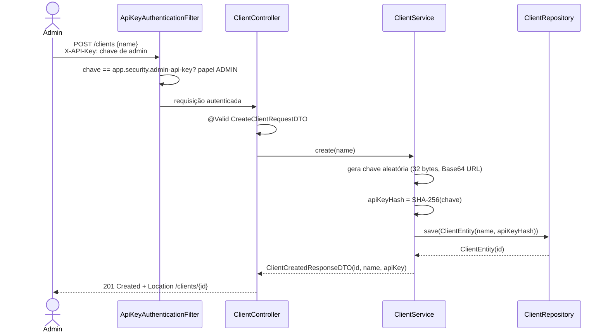
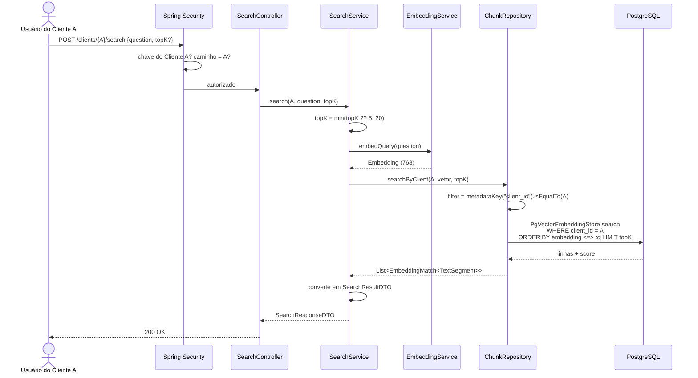
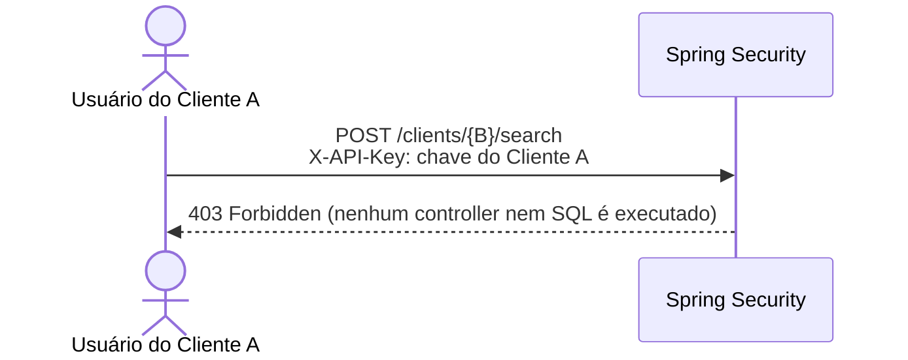
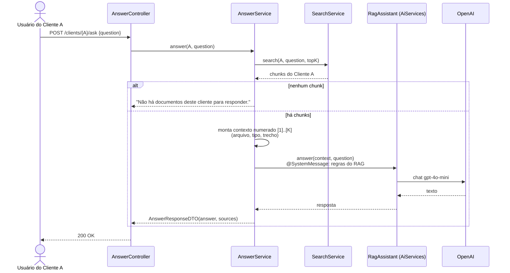

# 03 — Fluxos principais

Em todos os fluxos a requisição passa antes pela cadeia do Spring Security (ADR-008). Os diagramas mostram essa etapa só quando ela decide algo.

## 1. Cadastro de cliente (RF-003)



A chave em texto aberto aparece **só nessa resposta**. Depois disso o sistema guarda apenas o hash.

## 2. Ingestão de documento (RF-005, RF-006)

```mermaid
sequenceDiagram
    actor U as Usuário do Cliente A
    participant Sec as Spring Security
    participant C as DocumentController
    participant V as DocumentFileValidator
    participant D as DocumentService
    participant X as PdfTextExtractor
    participant T as TextChunker
    participant E as EmbeddingService
    participant O as OpenAI
    participant W as DocumentWriter
    participant R as ChunkRepository
    participant DB as PostgreSQL

    U->>Sec: POST /clients/{A}/documents<br/>file=contrato.pdf, documentType=CONTRACT
    Sec->>Sec: chave → clientId A; caminho = A? sim
    Sec->>C: requisição autorizada
    C->>V: validate(file) — não vazio, com nome ≤ 255, PDF
    V-->>C: nome limpo (ou InvalidFileException → 400)
    C->>D: ingest(A, fileName, CONTRACT, bytes)
    D->>X: extract(bytes) — ApachePdfBoxDocumentParser
    X-->>D: texto
    D->>T: split(texto) — DocumentSplitters.recursive
    T-->>D: List<Chunk>
    D->>E: embedDocuments(segmentos)
    E->>O: embeddings text-embedding-3-small (lote, 768)
    O-->>E: vetores 768
    E-->>D: List<Embedding>
    D->>W: save(A, fileName, CONTRACT, chunks, vetores)
    activate W
    W->>DB: INSERT document (JPA)
    W->>R: saveAll(A, document, chunks, embeddings)
    R->>DB: PgVectorEmbeddingStore.addAll<br/>INSERT document_chunk (N linhas, client_id = A)
    W-->>D: DocumentEntity(id), totalChunks
    deactivate W
    D-->>C: DocumentResponseDTO
    C-->>U: 201 Created
```

Falhas:

| Ponto | Resultado | Gravou algo? |
|---|---|---|
| Arquivo vazio, sem nome, nome acima de 255 caracteres ou não-PDF (`InvalidFileException`); `documentType` inválido | 400 | Não |
| Arquivo acima do limite | 413 | Não |
| PDF ilegível ou sem texto | 422 | Não |
| OpenAI indisponível, chave inválida ou limite de uso | 503 | Não (ainda não tinha chegado ao `DocumentWriter`) |
| Erro no INSERT do documento ou dos chunks | 500 | Não (rollback; o store participa da transação via `TransactionAwareDataSourceProxy`) |

## 3. Busca semântica (RF-007)



Acesso cruzado:



## 4. Resposta gerada (RF-008)



O isolamento da resposta vem de graça: o `AnswerService` só recebe chunks que já passaram pelo filtro de cliente do `SearchService`. Ele não acessa o banco diretamente, e o `RagAssistant` não tem `ContentRetriever` próprio.
