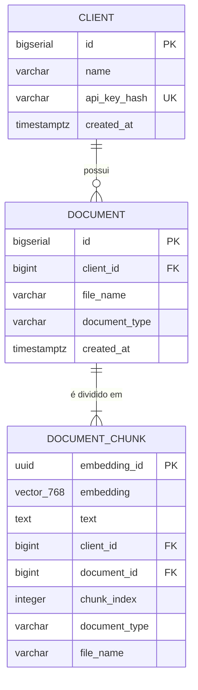

# 04 — Modelo de dados

## 1. Diagrama



`document_chunk` é a tabela do `PgVectorEmbeddingStore` do LangChain4j (ADR-004), no modo `COLUMN_PER_KEY`: as três primeiras colunas são as que a biblioteca exige (`embedding_id`, `embedding`, `text`), e as demais são os metadados de cada chunk, uma coluna por chave.

## 2. Diferenças em relação ao DDL do README

| Mudança | Motivo | Origem |
|---|---|---|
| `client.api_key_hash` e `client.created_at` | Autenticação por chave de cliente | ADR-008 |
| `document_chunk.id BIGSERIAL` → `embedding_id UUID` | Chave exigida pelo `PgVectorEmbeddingStore` | ADR-004 |
| `document_chunk.content` → `text` | Nome de coluna exigido pelo `PgVectorEmbeddingStore` | ADR-004 |
| `document_chunk.client_id` (novo, desnormalizado) | Filtro por cliente direto na tabela de chunks (`metadataKey("client_id")`) | ADR-004 |
| `document_chunk.document_type` e `file_name` (novos, desnormalizados) | Devolvidos na busca sem consulta extra a `document` | ADR-004 |
| FK composta `(document_id, client_id) → document (id, client_id)` | Garante que o `client_id` do chunk é sempre o do documento | ADR-004 |
| `embedding VECTOR(768) NOT NULL` | `text-embedding-3-small` com `dimensions = 768`; chunk sem vetor não participa da busca | ADR-006, RF-002 DP-03 |
| `CHECK` em `document_type` | Lista fechada `CONTRACT`, `CLAIM`, `INSPECTION` (`DocumentTypeEnum`) | RF-002 DP-02 |
| `TIMESTAMPTZ` em vez de `TIMESTAMP` | Evita ambiguidade de fuso horário | Arquitetura |
| `UNIQUE (document_id, chunk_index)` | Garante ordem sem duplicidade | RF-005 RN-02 |
| Índices em `document.client_id` e `document_chunk.client_id` | Aceleram o filtro por cliente | RF-002 DP-05 |
| `ON DELETE CASCADE` em `document_chunk` | Chunk não existe sem documento | RF-002 DP-04 |
| Sem `ON DELETE CASCADE` em `document` | Excluir cliente com documentos deve falhar, não apagar em silêncio | RF-002 DP-04 |

## 3. Migration `V1__create_tables.sql`

Caminho: `src/main/resources/db/migration/V1__create_tables.sql`.

```sql
CREATE EXTENSION IF NOT EXISTS vector;

CREATE TABLE client (
    id            BIGSERIAL    PRIMARY KEY,
    name          VARCHAR(255) NOT NULL,
    api_key_hash  VARCHAR(64)  NOT NULL,
    created_at    TIMESTAMPTZ  NOT NULL DEFAULT now(),
    CONSTRAINT uk_client_api_key_hash UNIQUE (api_key_hash)
);

CREATE TABLE document (
    id             BIGSERIAL    PRIMARY KEY,
    client_id      BIGINT       NOT NULL,
    file_name      VARCHAR(255) NOT NULL,
    document_type  VARCHAR(100) NOT NULL,
    created_at     TIMESTAMPTZ  NOT NULL,
    CONSTRAINT fk_document_client
        FOREIGN KEY (client_id) REFERENCES client (id),
    CONSTRAINT ck_document_type
        CHECK (document_type IN ('CONTRACT', 'CLAIM', 'INSPECTION')),
    CONSTRAINT uk_document_id_client UNIQUE (id, client_id)
);

CREATE INDEX document_client_id_idx ON document (client_id);

-- Tabela do PgVectorEmbeddingStore (LangChain4j), modo COLUMN_PER_KEY.
-- As colunas de metadados precisam bater com as columnDefinitions do AiConfig.
CREATE TABLE document_chunk (
    embedding_id   UUID         PRIMARY KEY,
    embedding      VECTOR(768)  NOT NULL,
    text           TEXT         NOT NULL,
    client_id      BIGINT       NOT NULL,
    document_id    BIGINT       NOT NULL,
    chunk_index    INTEGER      NOT NULL,
    document_type  VARCHAR(100) NOT NULL,
    file_name      VARCHAR(255) NOT NULL,
    CONSTRAINT fk_chunk_document_client
        FOREIGN KEY (document_id, client_id)
        REFERENCES document (id, client_id) ON DELETE CASCADE,
    CONSTRAINT uk_chunk_document_index UNIQUE (document_id, chunk_index)
);

CREATE INDEX document_chunk_client_id_idx ON document_chunk (client_id);

CREATE INDEX document_chunk_embedding_idx
    ON document_chunk
    USING hnsw (embedding vector_cosine_ops);
```

- `CREATE EXTENSION` aparece também aqui (além do `docker/init.sql`) para que a migration funcione em qualquer banco com pgvector, inclusive o do Testcontainers. Por isso o store usa `skipCreateVectorExtension(true)`.
- `uk_document_id_client` existe só para servir de alvo à FK composta.
- **Mudar a dimensão** (trocar de modelo, ADR-006) exige: nova migration alterando a coluna e recriando o índice, apagar os chunks existentes, reprocessar os documentos e atualizar `app.rag.embedding-dimension`.

## 4. Mapeamento JPA

Só `client` e `document` têm entidade JPA. `document_chunk` é acessada exclusivamente pelo `PgVectorEmbeddingStore` dentro do `ChunkRepository`.

- Toda entidade tem `@Table(name = ...)` explícito: `ClientEntity` → `client`, `DocumentEntity` → `document` (convenção de sufixos em 02, seção 4.1).
- `DocumentEntity.client`: `@ManyToOne(fetch = LAZY, optional = false)` com `@JoinColumn(name = "client_id")`.
- `DocumentEntity.documentType`: tipo `DocumentTypeEnum` (pacote `enums`), com `@Enumerated(EnumType.STRING)`; os valores batem com o `CHECK ck_document_type`.
- `DocumentEntity.createdAt`: preenchido pelo `DocumentWriter` com `Instant.now()` (RF-006 RN-02).
- `spring.jpa.hibernate.ddl-auto=validate`: o Hibernate confere o esquema das entidades; quem cria tudo é o Flyway (ADR-003). Ele ignora `document_chunk`, que não tem entidade.

## 5. Gravação e busca de chunks (`ChunkRepository`)

### 5.1 Gravação

Para cada chunk, um `TextSegment` com metadados cujas chaves são **os nomes das colunas**:

```java
Metadata metadata = new Metadata()
        .put("client_id", clientId)
        .put("document_id", document.getId())
        .put("chunk_index", chunk.index())
        .put("document_type", document.getDocumentType().name())
        .put("file_name", document.getFileName());

TextSegment segment = TextSegment.from(chunk.content(), metadata);
```

`embeddingStore.addAll(ids, embeddings, segments)` grava todos os chunks do documento num único lote, com `ids` gerados como `UUID` pelo próprio repository.

### 5.2 Busca

```java
Filter clientFilter = MetadataFilterBuilder.metadataKey("client_id").isEqualTo(clientId);

EmbeddingSearchRequest request = EmbeddingSearchRequest.builder()
        .queryEmbedding(queryEmbedding)
        .maxResults(topK)
        .minScore(0.0)
        .filter(clientFilter)
        .build();

List<EmbeddingMatch<TextSegment>> matches = embeddingStore.search(request).matches();
```

SQL equivalente gerado pela biblioteca (simplificado):

```sql
SELECT embedding_id, text, client_id, document_id, chunk_index, document_type, file_name,
       (2 - (embedding <=> :q)) / 2 AS score
FROM document_chunk
WHERE client_id = :clientId
ORDER BY embedding <=> :q
LIMIT :topK
```

- `<=>` é a distância de cosseno (0 = idêntico, 2 = oposto). A biblioteca devolve `score = (2 - distância) / 2`: **1 = idêntico**, 0 = oposto. A API devolve esse `score`, do maior para o menor.
- O filtro por cliente é sempre montado dentro do `ChunkRepository`; o método não existe sem `clientId`.
- Para conferir o SQL real, ligar o log do driver ou usar `pg_stat_statements` — bom exercício para ver o que o LangChain4j gera.

### 5.3 Cuidado: HNSW com filtro

O índice HNSW encontra os vizinhos mais próximos **antes** de aplicar o `WHERE`. Por padrão ele examina só `hnsw.ef_search = 40` candidatos; se a maioria for de outros clientes, a consulta devolve **menos de K** resultados, mesmo havendo chunks do cliente. Isso não vaza dados (o `WHERE` continua valendo), mas piora a resposta quando há muitos clientes.

Mitigação adotada (pgvector 0.8+): ligar a varredura iterativa na transação da busca.

```sql
SET LOCAL hnsw.iterative_scan = strict_order;
```

`ChunkRepository.searchByClient` é `@Transactional(readOnly = true)`: executa o `SET LOCAL` com `JdbcTemplate` e depois `embeddingStore.search(...)`. Como o store recebe o `DataSource` envolvido em `TransactionAwareDataSourceProxy`, os dois usam a mesma conexão e a mesma transação. A transação fica no repository, e não no `SearchService`, para não prender uma conexão enquanto o embedding da pergunta é gerado na OpenAI.

Com o volume do projeto (dois clientes, poucos documentos) o PostgreSQL provavelmente escolherá varredura sequencial e o efeito nem aparecerá; o ajuste existe para quando o volume crescer. Usar `EXPLAIN ANALYZE` para observar — é um bom exercício do objetivo de aprendizado "HNSW".
