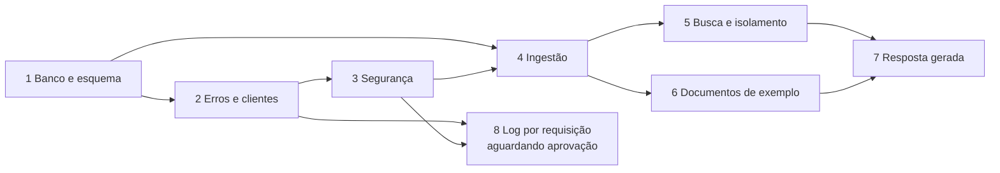

# 09 — Plano de implementação

Ordem pensada para que cada etapa termine com algo executável e testado. A divisão em tarefas `T-xxx` fica para o planejamento; aqui estão as etapas técnicas e o que cada uma precisa.

## 1. Dependências do `pom.xml`

Adicionar **na etapa que precisar** (README: novas tecnologias só quando necessárias). Versões gerenciadas pelo Spring Boot 4.1 e pelo `langchain4j-bom`. Os nomes da Etapa 1 foram conferidos no start.spring.io para o Boot 4.1.1 e já estão no `pom.xml`.

| Etapa | Dependência | Escopo |
|---|---|---|
| 1 ✔ | `spring-boot-starter-data-jpa` | compile |
| 1 ✔ | `org.postgresql:postgresql` | runtime |
| 1 ✔ | `spring-boot-starter-flyway`, `org.flywaydb:flyway-database-postgresql` | compile |
| 1 ✔ | `spring-boot-starter-data-jpa-test`, `spring-boot-starter-flyway-test` (fatias de teste do Boot 4) | test |
| 1 ✔ | `spring-boot-testcontainers`, `org.testcontainers:testcontainers-junit-jupiter`, `org.testcontainers:testcontainers-postgresql` | test |
| 1 ✔ | Plugins: `maven-surefire-plugin` (includes `*Test`, `*Tests`, `*IT`; `excludedGroups`; `-javaagent` do Mockito), `maven-dependency-plugin:properties`, `jacoco-maven-plugin` 0.8.15 (versão do Boot) | build |
| 2 | `spring-boot-starter-validation` | compile |
| 2 | `org.springdoc:springdoc-openapi-starter-webmvc-ui` 3.1.x (versão explícita; não gerenciada pelo Boot) | compile |
| 3 | `spring-boot-starter-security`, `spring-security-test` | compile / test |
| 4 | BOM `dev.langchain4j:langchain4j-bom` (1.20.x) em `dependencyManagement` | — |
| 4 | `dev.langchain4j:langchain4j` (núcleo: `AiServices`, splitters) | compile |
| 4 | `dev.langchain4j:langchain4j-open-ai` | compile |
| 4 | `dev.langchain4j:langchain4j-pgvector` (publicado como `-beta`; versão vem do BOM) | compile |
| 4 | `dev.langchain4j:langchain4j-document-parser-apache-pdfbox` | compile |

## 2. Etapas

### Etapa 1 — Banco e esquema (RF-001, RF-002) — **em andamento**

- ✔ `docker-compose.yml`, `docker/init.sql` (só o serviço `postgres` por enquanto). *(RF-001, 2026-10-01)*
- ✔ Propriedades de datasource, JPA e Flyway. *(RF-001)*
- ✔ Configuração Testcontainers; o `contextLoads` existente passa a usá-la (CT-002). *(RF-001)*
- `V1__create_tables.sql`; entidades `ClientEntity`, `DocumentEntity`; enum `DocumentTypeEnum` no pacote `enums`; repositories JPA. *(RF-002)*
- **Pronto quando:** `mvnw test` sobe o contêiner, aplica a migration (inclusive `document_chunk` com o índice HNSW) e grava/lê `ClientEntity` e `DocumentEntity`.

### Etapa 2 — Erros e cadastro de clientes (RF-010, RF-003)

- `GlobalExceptionHandler`, exceções, `ProblemDetail`.
- `ClientService`, `ClientController`, DTOs, geração de chave e hash (sem Spring Security ainda).
- `OpenApiConfig` e springdoc (ADR-013); anotações `@Tag`/`@Operation` no `ClientController`.
- **Pronto quando:** `POST /clients` cria cliente e devolve a chave, inclusive pelo Swagger UI; validações dão 400 no formato padrão.

### Etapa 3 — Segurança (RF-009)

- `SecurityConfig`, filtro, `ClientPrincipal`, `ClientAccessAuthorizationManager`, respostas 401/403.
- Liberar `/swagger-ui/**`, `/swagger-ui.html` e `/v3/api-docs/**` sem autenticação.
- **Pronto quando:** testes MockMvc de 401, 403 e acesso permitido passam; Swagger UI abre sem chave e o **Authorize** com `X-API-Key` funciona.

### Etapa 4 — Ingestão (RF-004, RF-005, RF-006)

- LangChain4j; `AiConfig` (`EmbeddingModel` OpenAI, `PgVectorEmbeddingStore`), `OpenAiProperties`, `RagProperties`.
- `EmbeddingService` + `FakeEmbeddingModel` de teste.
- `PdfTextExtractor`, `TextChunker` (parser e splitter do LangChain4j).
- `ChunkRepository.saveAll`, `DocumentService`, `DocumentWriter`, `DocumentController`.
- Teste de rollback: falha simulada no `addAll` não deixa `document` gravado (confirma o `TransactionAwareDataSourceProxy`).
- **Pronto quando:** `curl` (com `OPENAI_API_KEY`) grava documento e chunks com `client_id`; testes unitários e de integração da ingestão passam sem chamar a OpenAI.

### Etapa 5 — Busca (RF-007) e isolamento (RF-012)

- `ChunkRepository.searchByClient` com o filtro de [04](04%20Modelo%20de%20dados.md), seção 5.2, `SearchService`, `SearchController`.
- `TenantIsolationIT` com os casos 1–4 e 6 de [08](08%20Estrategia%20de%20testes.md).
- **Pronto quando:** todos os casos de isolamento passam. **Esta é a entrega mínima do projeto.**

### Etapa 6 — Documentos de exemplo (RF-011)

- Seis PDFs fictícios em `documents/cliente-a` e `documents/cliente-b`, com valores diferentes entre clientes; um cliente é perda total e o outro não (RF-011 RN-04). Feito na T-601: Cliente A é perda total, Cliente B não.
- `documents/gabarito.md` com as respostas esperadas (feito na T-601).
- Arquivo `http/requests.http` (ou script) para cadastrar os clientes e carregar os documentos.
- **Pronto quando:** as buscas das perguntas da seção 10 trazem os chunks certos no topo.

### Etapa 7 — Resposta gerada (RF-008)

- `ChatModel` OpenAI e `RagAssistant` (AiServices) no `AiConfig`, `AnswerService`, `AnswerController`.
- Caso 5 de isolamento.
- **Pronto quando:** as cinco perguntas da seção 10 têm resposta correta segundo o gabarito, para os dois clientes.

### Ajuste de estrutura — pacote `validator` e exceções próprias (ADR-014, 2026-10-05)

Refatoração sem mudança de comportamento externo; não exige dependência nova.

- Criar `validator/DocumentFileValidator` (`@Component`) com as regras hoje no método privado `validFileName` do `DocumentController` ([02](02%20Componentes%20e%20camadas.md), seção 3.2.1) e injetá-lo no controller.
- Criar `exception/InvalidFileException` e o `@ExceptionHandler` dela no `GlobalExceptionHandler` (400, `title` "Requisição inválida", `detail` = mensagem).
- Remover o uso de `ResponseStatusException` do `DocumentController` (único lugar onde aparece hoje).
- Teste unitário do `DocumentFileValidator` ([08](08%20Estrategia%20de%20testes.md), seção 6).
- **Pronto quando:** `mvnw verify` verde com os testes atuais do upload e do `GlobalExceptionHandler` sem alteração de status, títulos e mensagens; nenhum `ResponseStatusException` em `src/main/java`.

### Etapa 8 — Log por requisição (RF-013, ADR-015) — **aguardando aprovação**

Só começa depois que o responsável aprovar a ADR-015 e decidir as DP-01 a DP-07 do RF-013 ([Aprovacoes pendentes.md](Aprovacoes%20pendentes.md)); o usuário pediu que o desenvolvimento fique para outro momento. Não exige dependência nova no `pom.xml`. Depende da Etapa 3 (segurança, para os 401/403) e da Etapa 2 (`GlobalExceptionHandler`, para o 500 com o mesmo trace ID).

1. Ajustar a ADR-015 e os documentos 02, 06 e 08 ao que for decidido nas DPs.
2. Criar `logging/RequestLoggingFilter` ([02](02%20Componentes%20e%20camadas.md), seção 3.9; esboço na ADR-015) e as propriedades `app.logging.environment` e `logging.pattern.correlation` ([06](06%20Integracoes%20e%20configuracao.md), seção 9). Nenhuma mudança no `GlobalExceptionHandler`, no `SecurityConfig` ou nos controllers.
3. Se a DP-03 mantiver o cabeçalho `X-Trace-Id`, registrar o cabeçalho de resposta em [05](05%20API%20REST.md), seção 1, e no `OpenApiConfig` se o responsável quiser vê-lo no Swagger.
4. Testes de [08](08%20Estrategia%20de%20testes.md), seção 6.1, e os `CT-xxx` que o QA definir para o RF-013.
5. Atualizar o `CLAUDE.md` com o pacote `logging` e o guia de execução (`docs/guias/`) com onde ler o log e como achar uma requisição pelo trace ID.

- **Pronto quando:** `mvnw verify` verde; toda requisição de API gera uma linha com os dez campos (inclusive 401, 403 e 500); o erro do `GlobalExceptionHandler` mostra o mesmo trace ID; nenhum segredo nem hash nas linhas capturadas; respostas iguais às de antes (exceto o cabeçalho novo, se aprovado); nenhum teste chama a OpenAI.

## 3. Grafo de dependências

## 4. Definição de pronto (todas as etapas)

- Código nos pacotes e camadas de [02](02%20Componentes%20e%20camadas.md), sem SQL fora de `repository`.
- Endpoint novo ou alterado documentado com `@Operation` e `@ApiResponse` e testável pelo Swagger UI.
- Cenários `CT-xxx` da etapa ([QA 01, seção 7](../QA/01%20Estrategia%20de%20testes.md)) e da seção "Cenários de teste (QA)" de cada RF implementados, com o ID no `@DisplayName`, e passando em `mvnw test`.
- Nenhum segredo commitado; configuração nova documentada em `application.properties`.
- Desvio desta arquitetura → nova ADR ou atualização da ADR existente antes do merge.
