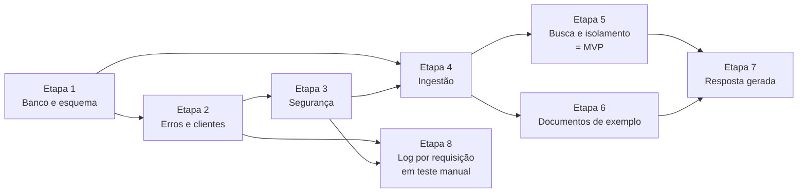

# Backlog — tenant-rag-pgvector

Atualizado em 06/10/2026.

Fonte do planejamento: funcionalidades (uma por requisito), cards `HU-xxx`, tarefas `T-xxx` e ordem de entrega. O dashboard (`Backlog/Backlog.json` e `Desenvolvimento/Desenvolvimento.json`) espelha este conteúdo.

> **Regra de escrita:** este arquivo mostra só o estado atual: uma frase curta por card/tarefa; não acumular histórico ("Antes: …") — o histórico fica no git e nas observações do dashboard.

Referências: requisitos em [`docs/requirements/`](../requirements/), arquitetura em [`docs/arquitetura/`](../arquitetura/README.md) (ordem das etapas em [09 Plano de implementacao.md](../arquitetura/09%20Plano%20de%20implementacao.md)), cenários de teste em [`docs/QA/`](../QA/README.md), aprovações em [Aprovacoes pendentes.md](../arquitetura/Aprovacoes%20pendentes.md).

## 1. Entregas

| Entrega | Etapas do plano | Funcionalidades | Critério de pronto |
|---|---|---|---|
| **Primeira entrega — pergunta e resposta por cliente** | 1 a 7 | RF-001 a RF-012 | Todos os cenários P1 passando; cliente cadastra, envia PDF, pergunta e recebe a resposta só com os próprios documentos; CT-070 a CT-074, CT-114, CT-075 e CT-076 OK |
| Marco intermediário — busca isolada | 1 a 5 | RF-001 a RF-007, RF-009, RF-010, RF-012 | Cliente cadastra, envia PDF e busca só nos próprios documentos (não é release sozinho) |
| Marco intermediário — documentos de exemplo | 6 | RF-011 | CT-100 a CT-102 passando; gabarito em `documents/gabarito.md` |

## 2. Funcionalidades

| ID | Funcionalidade | Prioridade | Etapa do plano | Depende de | Tarefas concluídas | Cenários | Progresso | Situação |
|---|---|---|---|---|---|---|---|---|
| [RF-001](../requirements/RF-001%20Ambiente%20PostgreSQL%20com%20pgvector.md) | Ambiente PostgreSQL com pgvector | Alta | 1 | — | 4 de 4 | 4 | 100% | Concluído |
| [RF-002](../requirements/RF-002%20Estrutura%20do%20banco%20e%20indice%20vetorial.md) | Estrutura do banco e índice vetorial | Alta | 1 | RF-001, RF-004 | 3 de 3 | 11 | 100% | Concluído |
| [RF-003](../requirements/RF-003%20Cadastro%20de%20clientes.md) | Cadastro de clientes | Alta | 2, 3, 5 | RF-002, RF-010 | 6 de 6 | 9 | 100% | Concluído |
| [RF-004](../requirements/RF-004%20Geracao%20de%20embeddings.md) | Geração de embeddings | Alta | 4, 7 | — | 5 de 5 | 8 | 100% | Concluído |
| [RF-005](../requirements/RF-005%20Extracao%20de%20texto%20e%20divisao%20em%20chunks.md) | Extração de texto e divisão em chunks | Alta | 4 | RF-004 | 3 de 3 | 8 | 100% | Concluído |
| [RF-006](../requirements/RF-006%20Ingestao%20de%20documentos%20do%20cliente.md) | Ingestão de documentos do cliente | Alta | 4 | RF-002, RF-003, RF-004, RF-005, RF-009, RF-010 | 6 de 6 | 14 | 100% | Concluído |
| [RF-007](../requirements/RF-007%20Busca%20semantica%20por%20cliente.md) | Busca semântica por cliente | Alta | 5 | RF-002, RF-003, RF-004, RF-006, RF-009, RF-010 | 5 de 5 | 10 | 100% | Concluído |
| [RF-008](../requirements/RF-008%20Resposta%20a%20perguntas%20com%20base%20nos%20documentos.md) | Resposta a perguntas com base nos documentos | Alta | 7 | RF-007, RF-009, RF-010, RF-011 | 5 de 5 | 9 | 100% | Concluído |
| [RF-009](../requirements/RF-009%20Controle%20de%20acesso%20por%20cliente.md) | Controle de acesso por cliente | Alta | 2, 3, 5 | RF-003, RF-010 | 5 de 5 | 11 | 100% | Concluído |
| [RF-010](../requirements/RF-010%20Tratamento%20padronizado%20de%20erros.md) | Tratamento padronizado de erros | Alta | 2, 3 | — | 2 de 2 | 9 | 60% | Em andamento |
| [RF-011](../requirements/RF-011%20Documentos%20de%20exemplo%20por%20cliente.md) | Documentos de exemplo por cliente | Alta | 6 | RF-003, RF-006 | 2 de 3 | 4 | 58% | Em andamento |
| [RF-012](../requirements/RF-012%20Testes%20de%20isolamento%20entre%20clientes.md) | Testes de isolamento entre clientes | Alta | 1, 3, 4, 5, 7 | RF-001, RF-002, RF-006, RF-007, RF-009, RF-008 | 6 de 7 | 10 | 58% | Em andamento |
| [RF-013](../requirements/RF-013%20Log%20de%20requisicoes%20para%20rastreamento.md) | Log de requisições para rastreamento | Média | 8 | RF-009, RF-010 | 6 de 6 | 13 | 61% | Em andamento |

**Progresso** = média das 8 etapas do pipeline (Requisitos, Planejamento, Arquitetura, Desenvolvimento, Testes, Revisão, Documentação, Release), igual ao dashboard. **Prioridade:** Alta = primeira entrega; Média = depois da primeira entrega ou com decisão pendente. **Cenários** = testes do card, inclusive os manuais.

**Pendências atuais:**

- **RF-003** — formato do nome do cliente (card HU-013) aguarda decisão do usuário com o analista-de-requisitos; T-206 e T-207 fora da contagem até a regra entrar no requisito.
- **RF-007** — limiar mínimo de similaridade (cards HU-015 e HU-014) aguarda decisão (hoje DP-03: `minScore` 0); T-506 a T-508 fora da contagem até a regra entrar no requisito.
- **RF-010** — falta o passo 4 do CT-132 e o CT-133 (manuais).
- **RF-011** — falta a T-602 (`http/requests.http`).
- **RF-012** — falta a T-108; manuais CT-135 e CT-136 não executados.
- **RF-013** — manuais CT-149 e CT-150 não executados (card HU-016 Em teste, fase Manual).

## 3. Histórias (cards)

Criadas pelo Planejador a partir do requisito, da arquitetura e dos cenários de QA. O texto da história e o histórico de observações ficam no card (`Desenvolvimento/Desenvolvimento.json` do dashboard).

**Fluxo do card:** Aguardando → Em andamento (dev) → Em teste, fase Manual (dev entregou com o build verde; uma pessoa executa os testes manuais) → Em revisão (direto do dev se não houver teste manual) → Concluído (no dashboard, "Aguardando release" até o RF entrar numa release). Erro do QA ou achado da revisão volta para Em andamento; Bloqueado é só para impedimento.

**Ordem dos cards:** Prioridade → Sem dependência → Depende de (só depois que os cards indicados estiverem prontos). Tarefa que depende de outro card traz o ID dele na coluna Depende de da seção 4.

| História | RF | Título | Ordem | Papéis | Tarefas | Testes do QA | Status |
|---|---|---|---|---|---|---|---|
| HU-001 | RF-001 | Ambiente local com PostgreSQL + pgvector | Prioridade | Dev Java, DevOps, QA | T-101, T-102, T-103, T-107 | CT-001, CT-002, CT-003, CT-116 | Concluído — na release v0.1.0 (Produção) |
| HU-002 | RF-002 | Esquema do banco e índice vetorial | Prioridade | DBA, Dev Java | T-104, T-105 | CT-002, CT-010, CT-011, CT-012, CT-013, CT-014, CT-015, CT-016, CT-051, CT-117, CT-118 | Concluído — na release v0.1.0 (Produção) |
| HU-003 | RF-003 | Cadastro de clientes | Depende de HU-002, HU-010, HU-007 | Dev Java, QA | T-202, T-203, T-204, T-205, T-505 | CT-020, CT-021, CT-023, CT-024, CT-025, CT-026, CT-027, CT-119, CT-120 | Concluído — na release v0.1.0 (Produção) |
| HU-004 | RF-004 | Geração de embeddings | Depende de HU-002 | Dev Java, QA | T-401, T-402, T-403, T-404 | CT-030, CT-031, CT-032, CT-033, CT-034, CT-035, CT-036, CT-121 | Concluído — na release v0.1.0 (Produção) |
| HU-005 | RF-005 | Extração de texto e divisão em chunks | Depende de HU-004 | Dev Java | T-405, T-406 | CT-040, CT-041, CT-042, CT-043, CT-044, CT-045, CT-122, CT-123 | Concluído — na release v0.1.0 (Produção) |
| HU-006 | RF-006 | Ingestão de documentos do cliente | Depende de HU-002, HU-003, HU-004, HU-005, HU-009, HU-010 | Dev Java, QA | T-407, T-408, T-409, T-410, T-411 | CT-050, CT-051, CT-052, CT-053, CT-054, CT-055, CT-056, CT-057, CT-058, CT-059, CT-124, CT-125, CT-126, CT-137 | Concluído — na release v0.1.0 (Produção) |
| HU-007 | RF-007 | Busca semântica por cliente | Depende de HU-002, HU-003, HU-004, HU-006, HU-009, HU-010 | Dev Java | T-501, T-502, T-503 | CT-060, CT-061, CT-062, CT-063, CT-064, CT-065, CT-066, CT-110, CT-127, CT-128 | Concluído — na release v0.1.0 (Produção) |
| HU-008 | RF-008 | Resposta com base nos documentos | Depende de HU-007, HU-009, HU-010, HU-011 | Dev Java, QA | T-701, T-702, T-703, T-705 | CT-070, CT-071, CT-072, CT-073, CT-074, CT-075, CT-076, CT-114, CT-129 | Concluído — na release v0.1.0 (Produção) |
| HU-009 | RF-009 | Controle de acesso por cliente | Depende de HU-003, HU-010 | Dev Java, QA | T-301, T-302, T-303 | CT-025, CT-026, CT-027, CT-080, CT-081, CT-082, CT-083, CT-084, CT-085, CT-130, CT-131 | Concluído — na release v0.1.0 (Produção) |
| HU-010 | RF-010 | Tratamento padronizado de erros | Sem dependência | Dev Java | T-201 | CT-024, CT-053, CT-062, CT-090, CT-091, CT-092, CT-093, CT-132, CT-133 | Em teste, fase Manual — falta o passo 4 do CT-132 e o CT-133 |
| HU-011 | RF-011 | Documentos de exemplo por cliente | Depende de HU-003, HU-006, HU-005 | Dev Java, QA | T-601, T-602, T-603 | CT-100, CT-101, CT-102, CT-134 | Em andamento — testes OK; falta a T-602 (`http/requests.http`) |
| HU-012 | RF-012 | Testes de isolamento entre clientes | Depende de HU-001, HU-002, HU-006, HU-007, HU-008, HU-009 | QA | T-106, T-108, T-504, T-704 | CT-002, CT-036, CT-110, CT-111, CT-112, CT-113, CT-114, CT-115, CT-135, CT-136 | Em andamento — falta a T-108 e os manuais CT-135 e CT-136 |
| HU-013 | RF-003 | Restringir formato do nome do cliente (segurança) | Depende de HU-003 | Dev Java, QA | T-206, T-207 | — (a criar pelo analista-de-qa) | Bloqueado — aguarda a decisão do formato do nome (analista-de-requisitos com o usuário) |
| HU-014 | RF-007 | Limiar mínimo de similaridade na busca | Depende de HU-007, HU-015 | Dev Java, QA | T-506, T-507 | — (a criar pelo analista-de-qa) | Aguardando — começa depois da decisão do limiar no HU-015 |
| HU-015 | RF-007 | Decidir o limiar mínimo de similaridade da busca | Depende de HU-007 | QA | T-508 | — (card de decisão, sem CT-xxx) | Aguardando — card de decisão; a T-508 mede os scores para sugerir o valor |
| HU-016 | RF-013 | Log de requisições para rastreamento | Depende de HU-009 | Dev Java, DevOps, QA | T-801, T-802, T-803, T-804, T-805, T-806 | CT-138, CT-139, CT-140, CT-141, CT-142, CT-143, CT-144, CT-145, CT-146, CT-147, CT-148, CT-149, CT-150 | Em teste, fase Manual — aguarda os manuais CT-149 e CT-150 |

## 4. Tarefas por etapa

Cada tarefa só termina com os cenários listados passando em `./mvnw test` (definição de pronto em [QA 01](../QA/01%20Estrategia%20de%20testes.md)).

### Etapa 1 — Banco e esquema

| Tarefa | Descrição | Requisitos | Cenários | História | Papel | Depende de | Status | Observação |
|---|---|---|---|---|---|---|---|---|
| T-101 | Criar `docker-compose.yml` (pgvector/pgvector:pg17) e `docker/init.sql` | RF-001 | CT-003 | HU-001 | DevOps | — | Concluída |  |
| T-102 | Adicionar ao `pom.xml`: JPA, driver PostgreSQL, Flyway, Testcontainers; configurar Surefire (`*IT`, tag `openai` excluída) e JaCoCo | RF-001, RF-012 | — | HU-001 | DevOps | — | Concluída |  |
| T-103 | Configurar `application.properties` (datasource, JPA `validate`, Flyway) e `application-test.properties` | RF-001 | — | HU-001 | Dev Java | — | Concluída |  |
| T-104 | Escrever a migration `V1__create_tables.sql` (client, document, document_chunk, HNSW, FK composta) | RF-002 | — | HU-002 | DBA | — | Concluída |  |
| T-105 | Criar `ClientEntity`, `DocumentEntity`, `DocumentTypeEnum`, `ClientRepository` e `DocumentRepository` | RF-002 | — | HU-002 | Dev Java | — | Concluída |  |
| T-106 | Criar a infraestrutura de teste: `PostgresTestcontainersConfig`, `AbstractIntegrationTest`, `TestDataBuilder` (parte JPA), `Fixtures` | RF-012 | CT-002 | HU-012 | QA | HU-002 | Concluída |  |
| T-107 | Implementar `SchemaMigrationIT` e `document-type-check.csv` | RF-001, RF-002 | CT-001, CT-010, CT-011, CT-012, CT-013, CT-014, CT-015 | HU-001 | QA | — | Concluída |  |
| T-108 | Criar `qa/atualizar-status-testes.py`: lê o Surefire e o JaCoCo, gera o resumo em `docs/QA/evidencias/execucoes/` e atualiza status, data e evidência dos cenários JUnit no `Testes.json` | RF-012 | — | HU-012 | QA | — | Pendente |  |

### Etapa 2 — Erros e cadastro de clientes

| Tarefa | Descrição | Requisitos | Cenários | História | Papel | Depende de | Status | Observação |
|---|---|---|---|---|---|---|---|---|
| T-201 | Criar exceções, `GlobalExceptionHandler` e respostas `ProblemDetail` | RF-010 | CT-090, CT-091, CT-092, CT-093 | HU-010 | Dev Java | — | Concluída |  |
| T-202 | Adicionar `spring-boot-starter-validation`; criar `CreateClientRequestDTO`, `ClientCreatedResponseDTO`, `ClientResponseDTO` | RF-003 | — | HU-003 | Dev Java | — | Concluída |  |
| T-203 | Implementar `ClientService` (geração da chave, hash SHA-256) e `ApiKeyHasher` | RF-003, RF-009 | CT-026, CT-083 | HU-003 | Dev Java | — | Concluída |  |
| T-204 | Implementar `ClientController` (`POST /clients`, `GET /clients/{clientId}`) e `client-name-validation.csv` | RF-003 | CT-020, CT-021, CT-023, CT-024 | HU-003 | Dev Java | — | Concluída |  |
| T-205 | Adicionar springdoc 3.1.x e `OpenApiConfig` | RF-003 | — | HU-003 | Dev Java | — | Concluída |  |
| T-206 | Validar o formato do nome em `CreateClientRequestDTO` (ex.: `@Pattern` com a regra decidida) e devolver 400 `problem+json` pelo `GlobalExceptionHandler`, com a mensagem decidida | RF-003, RF-010 | — (a criar pelo analista-de-qa) | HU-013 | Dev Java | HU-003 | Pendente | Bloqueada: aguarda a decisão do formato do nome. |
| T-207 | Incluir nomes válidos e inválidos (ex.: "Select * from client") no `client-name-validation.csv` e implementar os cenários automáticos de formato do nome | RF-003 | — (a criar pelo analista-de-qa) | HU-013 | QA | HU-003 | Pendente | Bloqueada: aguarda a decisão do formato do nome e os CT-xxx. |

### Etapa 3 — Segurança

| Tarefa | Descrição | Requisitos | Cenários | História | Papel | Depende de | Status | Observação |
|---|---|---|---|---|---|---|---|---|
| T-301 | Implementar `SecurityConfig`, `ApiKeyAuthenticationFilter`, `ClientPrincipal` e `ClientAccessAuthorizationManager` | RF-009 | — | HU-009 | Dev Java | — | Concluída |  |
| T-302 | Responder 401/403 em `ProblemDetail` e liberar as rotas do Swagger | RF-009, RF-010 | CT-085 | HU-009 | Dev Java | — | Concluída |  |
| T-303 | Criar `security-matrix.csv` e `SecurityConfigTest` | RF-009, RF-003, RF-012 | CT-025, CT-027, CT-080, CT-081, CT-082, CT-084, CT-115 | HU-009 | QA | HU-003 | Concluída | `security-matrix.csv` com 40 linhas (todos os endpoints atuais). |

### Etapa 4 — Ingestão

| Tarefa | Descrição | Requisitos | Cenários | História | Papel | Depende de | Status | Observação |
|---|---|---|---|---|---|---|---|---|
| T-401 | Adicionar o `langchain4j-bom` e os módulos `langchain4j`, `langchain4j-open-ai`, `langchain4j-pgvector`, `langchain4j-document-parser-apache-pdfbox` | RF-004, RF-005 | — | HU-004 | Dev Java | — | Concluída |  |
| T-402 | Criar `OpenAiProperties`, `RagProperties` e `AiConfig` (`EmbeddingModel`, `PgVectorEmbeddingStore` com `TransactionAwareDataSourceProxy`) | RF-004, RF-006 | — | HU-004 | Dev Java | HU-002 | Concluída |  |
| T-403 | Implementar `EmbeddingService` | RF-004 | CT-030, CT-031, CT-032, CT-033, CT-034 | HU-004 | Dev Java | — | Concluída |  |
| T-404 | Criar `FakeEmbeddingModel` e `AiTestConfig` | RF-004, RF-012 | CT-036 | HU-004 | QA | — | Concluída |  |
| T-405 | Criar `TestPdfFactory` e implementar `PdfTextExtractor` | RF-005 | CT-040, CT-041, CT-042 | HU-005 | Dev Java | — | Concluída |  |
| T-406 | Implementar `TextChunker` | RF-005 | CT-043, CT-044, CT-045 | HU-005 | Dev Java | — | Concluída | `DocumentSplitters.recursive` 1000/200 (`app.rag.chunk-size`/`chunk-overlap`). |
| T-407 | Implementar `ChunkRepository.saveAll` (metadados `COLUMN_PER_KEY`) | RF-006 | CT-051 | HU-006 | Dev Java | HU-002 | Concluída |  |
| T-408 | Implementar `DocumentService` e `DocumentWriter` | RF-006 | CT-054, CT-055 | HU-006 | Dev Java | — | Concluída | Reenvio do mesmo `fileName` substitui o documento anterior (RF-006 DP-03). |
| T-409 | Implementar `DocumentController` e `DocumentResponseDTO`; limite de 5 MB | RF-006 | CT-050, CT-052, CT-053, CT-057, CT-058, CT-059 | HU-006 | Dev Java | — | Concluída | Limite de 5 MB (413) com `server.tomcat.max-swallow-size=10MB`. |
| T-410 | Teste de rollback com falha em `saveAll` (confirma o `TransactionAwareDataSourceProxy`) | RF-006 | CT-056 | HU-006 | QA | — | Concluída |  |
| T-411 | Refatorar a validação do upload: pacote `validator` (`DocumentFileValidator`) e `InvalidFileException` no lugar de `ResponseStatusException` (ADR-014) | RF-006 | CT-052, CT-090, CT-091 | HU-006 | Dev Java | — | Concluída | Resposta da API igual à anterior. |

### Etapa 5 — Busca e isolamento

| Tarefa | Descrição | Requisitos | Cenários | História | Papel | Depende de | Status | Observação |
|---|---|---|---|---|---|---|---|---|
| T-501 | Implementar `ChunkRepository.searchByClient` (filtro `client_id`, `SET LOCAL hnsw.iterative_scan`) | RF-007 | CT-060, CT-065, CT-066 | HU-007 | Dev Java | — | Concluída | `minScore` 0 (RF-007 DP-03). |
| T-502 | Implementar `SearchService`, `SearchRequestDTO`, `SearchResponseDTO`, `SearchResultDTO` | RF-007 | — | HU-007 | Dev Java | — | Concluída | `topK` padrão 5 e teto 20. |
| T-503 | Implementar `SearchController`, `question-validation.csv` e `topk-validation.csv` | RF-007 | CT-061, CT-062, CT-064 | HU-007 | Dev Java | — | Concluída |  |
| T-504 | Implementar `TenantIsolationIT` e `isolation-matrix.csv` | RF-012, RF-007 | CT-110, CT-111, CT-112, CT-113 | HU-012 | QA | HU-007 | Concluída |  |
| T-505 | Implementar `ApiFlowIT` (cadastro → busca de ponta a ponta) | RF-003, RF-007, RF-009 | CT-063 | HU-003 | QA | HU-007 | Concluída |  |
| T-506 | Aplicar o limiar mínimo de similaridade (`minScore` configurável, ex.: `app.rag.min-score` em `RagProperties`) em `ChunkRepository.searchByClient`/`SearchService`, sem tirar o filtro `client_id`; testes | RF-007, RF-008 | — (a criar pelo analista-de-qa) | HU-014 | Dev Java | HU-007 | Pendente | Aguarda a decisão do limiar (HU-015). |
| T-507 | Implementar os cenários automáticos do limiar (pergunta sem relação → `results` vazio; resultados abaixo do limiar descartados; `/ask` com resposta fixa) | RF-007, RF-008 | — (a criar pelo analista-de-qa) | HU-014 | QA | HU-007 | Pendente | Aguarda a decisão do limiar e os CT-xxx. |
| T-508 | Medir os scores de similaridade das perguntas do gabarito (`gabarito-perguntas.csv`) e de perguntas sem relação com `POST /clients/{clientId}/search` e a chave real; sugerir o limiar mínimo | RF-007, RF-008 | — (card de decisão) | HU-015 | QA | HU-007 | Pendente | Executada por uma pessoa (Postman/Swagger), sem código. |

### Etapa 6 — Documentos de exemplo

| Tarefa | Descrição | Requisitos | Cenários | História | Papel | Depende de | Status | Observação |
|---|---|---|---|---|---|---|---|---|
| T-601 | Escrever os 6 PDFs fictícios e `documents/gabarito.md` | RF-011 | — | HU-011 | QA | — | Concluída | PDFs escritos pelo usuário (RF-011 DP-01). |
| T-602 | Criar `http/requests.http` para cadastrar clientes e carregar os documentos | RF-011 | — | HU-011 | Dev Java | HU-006 | Pendente |  |
| T-603 | Implementar `SampleDocumentsIT` | RF-011 | CT-100, CT-101, CT-102 | HU-011 | QA | HU-005 | Concluída |  |

### Etapa 7 — Resposta gerada

| Tarefa | Descrição | Requisitos | Cenários | História | Papel | Depende de | Status | Observação |
|---|---|---|---|---|---|---|---|---|
| T-701 | Adicionar `ChatModel` (OpenAI) e `RagAssistant` (AiServices) ao `AiConfig` | RF-008 | — | HU-008 | Dev Java | — | Concluída |  |
| T-702 | Implementar `AnswerService` | RF-008 | CT-070, CT-071, CT-073 | HU-008 | Dev Java | — | Concluída | `topK` padrão 8 (`app.rag.answer-top-k`). |
| T-703 | Implementar `AnswerController`, `AskRequestDTO`, `AnswerResponseDTO`, `SourceResponseDTO` | RF-008 | CT-072, CT-074 | HU-008 | Dev Java | — | Concluída |  |
| T-704 | Cenário de isolamento do `/ask` | RF-012, RF-008 | CT-114 | HU-012 | QA | HU-008 | Concluída |  |
| T-705 | Implementar `RagQualityOpenAiIT` e `gabarito-perguntas.csv` (opt-in) | RF-008, RF-004 | CT-035, CT-075, CT-076 | HU-008 | QA | HU-011 | Concluída | Executada pelo usuário com a OpenAI real em 05/10/2026, 12 de 12. |

### Etapa 8 — Log por requisição

Implementada; `CLAUDE.md` e guias atualizados pelo desenvolvedor.

| Tarefa | Descrição | Requisitos | Cenários | História | Papel | Depende de | Status | Observação |
|---|---|---|---|---|---|---|---|---|
| T-801 | Criar `logging/RequestLoggingFilter` (`OncePerRequestFilter`, antes do Spring Security): trace ID no MDC, duração, uma linha por requisição com os dez campos, nível por status, Swagger fora; propriedades `app.logging.environment` e `logging.pattern.correlation` | RF-013, RF-009, RF-010 | — | HU-016 | Dev Java | HU-009 | Concluída | `logging/RequestLoggingFilter`; evidência `2026-10-06-rf-013.md`. |
| T-802 | Devolver o trace ID no cabeçalho de resposta `X-Trace-Id` (DP-03); declará-lo no `OpenApiConfig` não faz parte da etapa | RF-013 | — | HU-016 | Dev Java | — | Concluída | Cabeçalho sai também nos 401/403 e no 413. |
| T-803 | Criar `RequestLoggingFilterTest` (unitário, sem Spring): campos, `clientId`, `status=500` com exceção relançada, `traceId`, MDC limpo, nível por status, Swagger sem linha | RF-013 | CT-138, CT-139, CT-140, CT-141, CT-142, CT-145, CT-148 | HU-016 | QA | — | Concluída | Mais `LoggingConfigurationTest` (CT-148). |
| T-804 | Testes web (slice) do log com `OutputCaptureExtension`: 200, 401, 403 e 500 com o mesmo `[traceId]` na linha da requisição e no `ERROR` do `GlobalExceptionHandler`; respostas iguais às de antes | RF-013, RF-009, RF-010 | CT-143, CT-144, CT-145 | HU-016 | QA | — | Concluída | `RequestLoggingWebTest` e CT-144 no `GlobalExceptionHandlerTest`. |
| T-805 | Criar o IT de segredos ausentes no log (`OutputCaptureExtension`): chaves, hash, chave da OpenAI e senha do banco fora de todas as linhas; `/ask` e `/documents` sem pergunta, texto nem nome do arquivo; sem OpenAI | RF-013, RF-009, RF-012 | CT-146, CT-147 | HU-016 | QA | HU-009 | Concluída | `RequestLoggingIT`; senha própria no `PostgresTestcontainersConfig`. |
| T-806 | Incluir a variável opcional `APP_ENVIRONMENT` (padrão `local`) no `.env.example`, para o campo `environment` do log (DP-04) | RF-013 | — | HU-016 | DevOps | — | Concluída |  |

## 5. Ordem e dependências

- **Prioridade:** HU-001, HU-002.
- **Sem dependência:** HU-010.
- **Com dependência:** os demais; HU-013 depende de HU-003; HU-014 de HU-007 e HU-015; HU-015 de HU-007; HU-016 de HU-009.

## 6. Resumo

- Funcionalidades: 13 — Alta: 12 (RF-001 a RF-012), Média: 1 (RF-013); Concluído em release: 9 — v0.1.0 em Produção (RF-001 a RF-009); Em andamento: 4 (RF-010 a RF-013).
- Cards: 16 — Concluído: 9 (HU-001 a HU-009, na release v0.1.0), Em teste: 2 (HU-010, HU-016, fase Manual), Em andamento: 2 (HU-011, HU-012), Aguardando: 2 (HU-014, HU-015), Bloqueado: 1 (HU-013), Em revisão: 0.
- Tarefas: 51 em 8 etapas — Concluída: 44, Pendente: 7 (T-108, T-206, T-207, T-506, T-507, T-508, T-602).
- Cenários de teste: 108 — OK: 102, Não iniciada: 6 (CT-132, CT-133, CT-135, CT-136, CT-149, CT-150); bugs abertos: 0.
- Release: v0.1.0 em Produção desde 06/10/2026 (aprovada pelo usuário) com HU-001 a HU-009 (RF-001 a RF-009); commit 4f27e73; sem tag por decisão do usuário (projeto de estudo).
- Bloqueios e decisões pendentes:
  - HU-013 — formato do nome do cliente (RF-003).
  - HU-015 → HU-014 — valor do limiar mínimo de similaridade, se é configurável e o efeito no `/ask` (RF-007 DP-03).

**Decisões registradas**

- 02/10/2026 — RF-008 entra na primeira entrega; RF-001 a RF-012 passam a Alta (RF-008 DP-06).
- 02/10/2026 — Reenviar o mesmo arquivo (mesmo `fileName` do mesmo cliente) substitui o documento anterior (RF-006 DP-03).
- 02/10/2026 — PDFs de exemplo escritos pelo usuário e versionados no repositório (RF-011 DP-01 e DP-02).
- 02/10/2026 — `DocumentRepository` com `findById`/`findAll` sem `clientId`: não será corrigido; toda leitura nova de `document` filtra por cliente (achado #1 do RF-002).
- 05/10/2026 — Limite de upload de 5 MB (antes 10 MB) (RF-006 DP-02).
- 05/10/2026 — Refatoração da validação do upload aprovada (ADR-014).
- 05/10/2026 — RF-013 (log por requisição) fora da v0.1.0.
- 05/10/2026 — Escopo da v0.1.0: HU-001 a HU-009 (RF-001 a RF-009).
- 05/10/2026 — Os agentes não fazem commit, tag nem push; o git fica com o usuário.
- 05/10/2026 — Sem IDs de requisito ou cenário (RF-xxx, CT-xxx) no código de produção; os testes mantêm o CT no `@DisplayName`.
- 06/10/2026 — ADR-015 e DP-01 a DP-07 do RF-013 aprovadas como recomendado.
- 05/10/2026 — HU-013, HU-014 e HU-015 ficam para outro momento.
- 06/10/2026 — v0.1.0 aprovada para Produção; sem tag (projeto de estudo).
