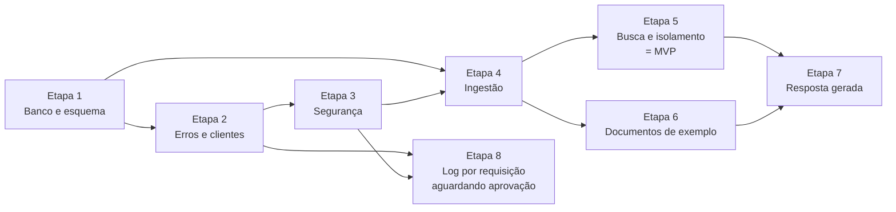

# Backlog — tenant-rag-pgvector

Atualizado em 05/10/2026 (QA: cenários do RF-013 criados — CT-138 a CT-148 automáticos e CT-149 e CT-150 manuais (console da IDE), todos Não iniciada, em `testes` do HU-016 e nas T-803 a T-805; esperado pela recomendação da ADR-015 até a decisão das DP-02 a DP-07; card continua Bloqueado. Antes, no mesmo dia: planejador: card HU-016 — Log de requisições para rastreamento — criado a pedido do usuário, ligado ao RF-013 (Média), com a arquitetura proposta na ADR-015 (Em revisão) e na Etapa 8 do plano (aguardando aprovação); status Bloqueado até a aprovação da ADR-015 e das DP-01 a DP-07 do RF-013 (`docs/arquitetura/Aprovacoes pendentes.md`, linhas 2 a 9); desenvolvimento para outro momento, por decisão do usuário; sem prioridade, depende do HU-009 e do HU-010; tarefas T-801 a T-806 (Dev Java, QA e DevOps) na nova tabela da Etapa 8; testes do QA a criar pelo analista-de-qa. Antes, no mesmo dia: revisão do RF-006 reconferida pelo revisor depois da refatoração da ADR-014 (T-411): aprovado para fechamento — comportamento externo igual (mesma ordem de regras, mensagens, limpeza do nome e aceite por content-type ou extensão; `..\..\pasta\evil.pdf` → `evil.pdf`), aderente à ADR-014 e à 02 (sem `ResponseStatusException` em `src/main`); achado #3 Mínima corrigido; nenhum achado novo; #2 Baixa (a confirmar) e #4 Mínima abertos, não impeditivos; testes reexecutados (`DocumentFileValidatorTest` 17/17, `DocumentControllerTest` 16/16, `GlobalExceptionHandlerTest` 18/18, `DocumentIngestionIT` 10/10); HU-006 Concluído, aguardando release. Antes, no mesmo dia: dev: refatoração da ADR-014 no RF-006 — T-411 concluída: regras do arquivo do upload no novo `validator/DocumentFileValidator` e `InvalidFileException` (400) no lugar do `ResponseStatusException`, sem mudança de status, títulos ou mensagens; achado #3 da revisão do RF-006 corrigido com o `DocumentFileValidatorTest` (proposto, aguardando re-revisão); `mvnw verify` 269 de 269; HU-006 volta de Concluído para Em revisão. Antes, no mesmo dia: CT-132 executado em parte pelo usuário — HU-010 segue Em teste, fase Manual, aguardando o passo 4 do CT-132 e o CT-133. Antes, no mesmo dia: revisão do RF-009 reconferida pelo revisor: aprovado para fechamento — arquivos de segurança sem mudança desde 02/10/2026; mudanças do RF-010 e do RF-006 no `GlobalExceptionHandler` e no `application.properties` não afetam 401/403, regras de rota, a matriz nem o 403 idêntico para cliente existente e inexistente; testes do RF-009 reexecutados, 84 de 84, sem OpenAI; CT-130 e CT-131 OK; nenhum achado novo; achado #1 Baixa aberto, não impeditivo; HU-009 Concluído, aguardando release. Antes, no mesmo dia: CT-130 completo e OK, executado pelo usuário: todos os testes do HU-009 OK — o card sai da fase Manual para Em revisão. Antes, no mesmo dia: CT-134 OK, informado pelo usuário: todos os testes do HU-011 OK; o card segue Em andamento até a T-602. Antes, no mesmo dia: testes manuais do HU-009 executados pelo usuário: CT-131 OK e CT-130 parcial — HU-009 segue Em teste, fase Manual, aguardando o `/clients/999` do passo 5 do CT-130. Antes, no mesmo dia: revisão do RF-008 reconferida pelo revisor: aprovado para fechamento — código sem mudança desde 02/10/2026; isolamento correto (só chunks do cliente do caminho no prompt); testes do RF-008 reexecutados, 38 de 38, sem OpenAI; CT-075, CT-076 e CT-129 OK; achado #1 revisto de Média para Baixa (CA-02 verificado pelo CT-129); achados #1 a #4 Baixa abertos, não impeditivos; HU-008 Concluído, aguardando release. Antes, no mesmo dia: CT-129 OK, executado pelo usuário: todos os testes do HU-008 OK — o card sai da fase Manual para Em revisão. Antes, no mesmo dia: revisão do RF-007 reconfirmada pelo revisor: nenhum arquivo do RF-007 mudou desde a aprovação de 02/10/2026; isolamento correto; testes do RF-007 reexecutados, 46 de 46; CT-127 e CT-128 OK; nenhum achado novo; achados #1 a #3 Baixa e #4 Mínima abertos, não impeditivos; HU-007 Concluído, aguardando release; o limiar de similaridade segue nos cards HU-015 e HU-014. Antes, no mesmo dia: card de decisão HU-015 — Decidir o limiar mínimo de similaridade da busca — criado pelo planejador a pedido do usuário, ligado ao RF-007: valor do minScore (entre ~0,65 e ~0,77), se é configurável (`app.rag.min-score`) e o efeito no `/ask`; decisão do usuário com o analista-de-requisitos e o arquiteto-de-software, registrada no RF-007 DP-03 e na arquitetura 04; tarefa T-508 (QA) mede os scores para sugerir o valor; status Aguardando, depende do HU-007; o HU-014 passa a depender também do HU-015. Antes, no mesmo dia: CT-128 completo e OK, executado pelo usuário: todos os testes do HU-007 OK — o card sai da fase Manual para Em revisão. Antes, no mesmo dia: card HU-014 — Limiar mínimo de similaridade na busca — criado pelo planejador a pedido do usuário, ligado ao RF-007 (melhoria), depois de perguntas sem relação com os documentos devolverem resultados nos testes manuais do HU-007; status Aguardando, depende do HU-007; decisão pendente do limiar (rever RF-007 DP-03). Antes, no mesmo dia: testes manuais do HU-007 executados pelo usuário: CT-127 OK e CT-128 parcial — HU-007 segue Em teste, fase Manual, aguardando o passo 3 do CT-128. Antes, no mesmo dia: fechamento do RF-004 e do RF-005 confirmado pelo revisor — nenhuma mudança de código depois da revisão de hoje; todos os testes dos cards OK; HU-004 e HU-005 Concluído, aguardando release; RF-004 com o achado #3 Mínima aberto, não impeditivo; RF-005 sem achados. Antes, no mesmo dia: CT-123 OK, executado pelo usuário — HU-005 sai da fase Manual para Em revisão. Antes, no mesmo dia: CT-075 OK na reexecução, 12 de 12 — HU-008 segue Em teste, fase Manual, aguardando o CT-129; CT-123 executado em parte — HU-005 segue Em teste, fase Manual. Antes, no mesmo dia: opt-in executados pelo usuário com a chave real, pelo IntelliJ: CT-035 e CT-076 OK, CT-075 com 9 de 10 casos OK, aguardando reexecução; HU-004 vai para Em revisão; HU-008 segue Em teste, fase Manual. Antes, no mesmo dia: teste manual CT-121 OK, executado pelo usuário; HU-004 segue Em teste, fase Manual, aguardando só o CT-035 — o print recebido para ele era de um relatório antigo e não conta como execução. Antes, no mesmo dia: revisões do RF-004 e do RF-005 reconferidas pelo revisor: código aprovado para fechamento — RF-004 com o achado #1 corrigido e o achado novo #3 Mínima aberto, não impeditivo; RF-005 sem achados; HU-004 e HU-005 seguem Em teste, fase Manual, e vão para Concluído quando passarem os testes manuais CT-035 e CT-121 (HU-004) e CT-123 (HU-005), sem nova revisão. Antes, no mesmo dia: revisões do RF-003 e do RF-006 reconfirmadas pelo revisor: HU-003 e HU-006 Concluído, aguardando release; RF-003 com o achado novo #4 Mínima aberto; RF-006 com o achado #1 corrigido e reconferido, #2 Baixa e #3 e #4 Mínima abertos, não impeditivos; pendências de documentação do limite de 5 MB para o arquiteto-de-software e o documentador-tecnico. Antes, no mesmo dia: testes manuais executados pelo usuário: CT-137 OK com o limite de 5 MB — HU-006 sai da fase Manual para Em revisão — e CT-122 OK — HU-005 segue Em teste, fase Manual, aguardando o CT-123. Antes, no mesmo dia: dev: limite de upload reduzido para 5 MB no código — RF-006 DP-02 —, com `server.tomcat.max-swallow-size=10MB` para corrigir o achado #1 da revisão do RF-006 (proposto, aguardando re-revisão); `mvnw verify` 245 de 245; HU-006 segue Em teste, fase Manual, e o CT-137 já pode ser executado. Antes, no mesmo dia: testes manuais do HU-006 executados pelo usuário: CT-124, CT-125 e CT-126 OK; HU-006 segue Em teste, fase Manual, aguardando o CT-137, reescrito para o novo limite de upload de 5 MB decidido pelo usuário. Antes, no mesmo dia: CT-120 completo e OK, executado pelo usuário: todos os testes manuais do HU-003 OK — o card sai da fase Manual para Em revisão. Antes, no mesmo dia: card HU-013 — Restringir formato do nome do cliente (segurança) — criado pelo planejador a pedido do usuário, ligado ao RF-003, depois do CT-119 aceitar o nome "Select * from client"; Bloqueado por decisão pendente; HU-003 segue Em teste, fase Manual. Antes, no mesmo dia: revisão do RF-001 reconfirmada depois do CT-116: HU-001 Concluído, aguardando release; achado #7 Baixa continua aberto. Antes, no mesmo dia: revisão do RF-002 reconfirmada: HU-002 Concluído, aguardando release. Antes: testes manuais executados pelo usuário: CT-116, CT-117 e CT-118 OK — HU-001 e HU-002 saem da fase Manual para Em revisão; o CT-116 teve primeiro uma evidência incompleta, completada no mesmo dia. Antes, 02/10/2026: fase QA removida do fluxo: o dev entrega com o build verde e o card vai para Em teste, fase Manual; HU-010 passou para a fase Manual. Antes: RF-010 implementado — T-201 concluída; GlobalExceptionHandlerTest com CT-090 a CT-093; type e detail em português em todo ProblemDetail; mvnw verify 245 de 245; HU-010 para Em teste, fase QA. Antes: CT-137 — upload acima de 10 MB recusado com 413 — criado pelo QA como teste manual do HU-006, a pedido do usuário, mesmo com o achado #1 da revisão do RF-006 aberto; HU-006 continua Em teste, fase Manual; colunas Cenários (testes do card, incluindo os manuais) e Progresso da seção 2 alinhadas ao dashboard. Antes: testes manuais de todos os cards: CT-116 a CT-136 criados pelo QA, com roteiros em `docs/QA/07 Testes manuais.md`, e os opt-in CT-035, CT-075 e CT-076 com execução Manual; por decisão do usuário, HU-001, HU-002, HU-003, HU-005, HU-006, HU-007 e HU-009 voltaram de Concluído para Em teste, fase Manual, aguardando a execução; HU-004 e HU-008 continuam na fase Manual; HU-010 a HU-012 continuam Em andamento. Antes: novo fluxo dos cards: flags de ordem — Prioridade, Sem dependência, Depende de — nos cards e nas tarefas; status Em revisão; fase Manual para testes manuais; HU-004 e HU-008 na fase Manual, aguardando a execução do CT-035, CT-075 e CT-076; RF-009 com revisão a 100% e RF-010 com T-302 concluída no progresso. Antes: revisão de código do RF-009 aprovada — 1 achado Baixo aberto, não impeditivo; achado #3 do RF-003 reconferido e corrigido; HU-009 Concluído. Antes: QA do RF-009 aprovado — mvnw verify 229 de 229, CT-025, CT-026, CT-027, CT-080 a CT-085 e CT-115 OK, nenhum bug; HU-009 para Em teste, fase Revisão. Antes: RF-009 implementado — T-302 e T-303 concluídas; security-matrix.csv com 40 linhas; CT-080, CT-081, CT-082, CT-084, CT-085 e CT-115 passando; achado #3 da revisão do RF-003 corrigido, a reconferir; mvnw verify 229 de 229; HU-009 para Em teste, fase QA. Antes: QA do RF-008 — mvnw verify 174 de 174, CT-070 a CT-074 e CT-114 OK, nenhum bug; CT-075 e CT-076 opt-in Bloqueado, o usuário vai executá-los manualmente; RF-008 ainda não aceito e HU-008 mantido em Em teste, fase QA, como o HU-004. Antes: RF-008 implementado — T-701 a T-703, T-705 escrita — com a T-704 do RF-012; mvnw verify 174 de 174; CT-070 a CT-074 e CT-114 passando, CT-075 e CT-076 opt-in escritos e não executados; HU-008 para Em teste, fase QA. Antes: revisão de código do RF-007 aprovada — 3 achados Baixos e 1 Mínimo abertos, não impeditivos; HU-007 Concluído. Antes: QA do RF-007 aprovado — mvnw verify 149 de 149, CT-060 a CT-066 e CT-110 a CT-113 OK, nenhum bug; HU-007 Em teste, fase Revisão. Antes: RF-007 implementado — T-501 a T-503 — com a T-504 do RF-012 e o CT-063 que fecha a T-505; mvnw verify 149 de 149; HU-007 para Em teste, fase QA. Antes: revisão de código do RF-005 e do RF-006 aprovada — RF-005 sem achados; RF-006 com 2 achados Baixos e 1 Mínimo abertos, não impeditivos; achado #2 do RF-003 corrigido; HU-005 e HU-006 Concluído. Antes: QA do RF-005 e do RF-006 aprovado — 112 de 112, CT-040 a CT-045 e CT-050 a CT-059 OK, nenhum bug; RF-005 e RF-006 implementados — T-405 a T-410 — e T-603; RF-006 DP-03 decidida: reenvio substitui; T-601, QA e revisão do RF-003 aprovados, HU-003 Concluído). Fonte única do planejamento: funcionalidades (uma por requisito), prioridades, ordem de entrega e tarefas `T-xxx`. O dashboard (`Backlog/Backlog.json`) é gerado a partir deste conteúdo.

Referências: requisitos em [`docs/requirements/`](../requirements/), arquitetura em [`docs/arquitetura/`](../arquitetura/README.md) (ordem das etapas em [09 Plano de implementacao.md](../arquitetura/09%20Plano%20de%20implementacao.md)), cenários de teste em [`docs/QA/`](../QA/README.md).

## 1. Entregas

| Entrega | Etapas do plano | Funcionalidades | Critério de pronto |
|---|---|---|---|
| **Primeira entrega — pergunta e resposta por cliente** | 1 a 7 | RF-001 a RF-012 | Todos os cenários P1 passando; cliente cadastra, envia PDF, faz a pergunta e recebe a resposta só com os próprios documentos; CT-070 a CT-074 e CT-114 passando; CT-075 e CT-076 (OpenAI real) executados. Decidido pelo usuário em 02/10/2026 (RF-008 DP-06) |
| Marco intermediário — busca isolada | 1 a 5 | RF-001 a RF-007, RF-009, RF-010, RF-012 | Cliente cadastra, envia PDF e busca só nos próprios documentos (base para a Etapa 7; não é release sozinho) |
| Marco intermediário — documentos de exemplo | 6 | RF-011 | CT-100 a CT-102 passando; gabarito escrito (`documents/gabarito.md`, pronto) |

## 2. Funcionalidades

| ID | Funcionalidade | Prioridade | Etapa do plano | Depende de | Tarefas concluídas | Cenários | Progresso | Situação |
|---|---|---|---|---|---|---|---|---|
| [RF-001](../requirements/RF-001%20Ambiente%20PostgreSQL%20com%20pgvector.md) | Ambiente PostgreSQL com pgvector | Alta | 1 | — | 4 de 4 | 4 | 88% | Em andamento |
| [RF-002](../requirements/RF-002%20Estrutura%20do%20banco%20e%20indice%20vetorial.md) | Estrutura do banco e índice vetorial | Alta | 1 | RF-001, RF-004 | 3 de 3 | 11 | 88% | Em andamento |
| [RF-003](../requirements/RF-003%20Cadastro%20de%20clientes.md) | Cadastro de clientes | Alta | 2, 3, 5 | RF-002, RF-010 | 6 de 6 | 9 | 88% | Em andamento |
| [RF-004](../requirements/RF-004%20Geracao%20de%20embeddings.md) | Geração de embeddings | Alta | 4, 7 | — | 5 de 5 | 8 | 88% | Em andamento |
| [RF-005](../requirements/RF-005%20Extracao%20de%20texto%20e%20divisao%20em%20chunks.md) | Extração de texto e divisão em chunks | Alta | 4 | RF-004 | 3 de 3 | 8 | 88% | Em andamento |
| [RF-006](../requirements/RF-006%20Ingestao%20de%20documentos%20do%20cliente.md) | Ingestão de documentos do cliente | Alta | 4 | RF-002, RF-003, RF-004, RF-005, RF-009, RF-010 | 6 de 6 | 14 | 88% | Em andamento |
| [RF-007](../requirements/RF-007%20Busca%20semantica%20por%20cliente.md) | Busca semântica por cliente | Alta | 5 | RF-002, RF-003, RF-004, RF-006, RF-009, RF-010 | 5 de 5 | 10 | 88% | Em andamento |
| [RF-008](../requirements/RF-008%20Resposta%20a%20perguntas%20com%20base%20nos%20documentos.md) | Resposta a perguntas com base nos documentos | Alta | 7 | RF-007, RF-009, RF-010, RF-011 | 5 de 5 | 9 | 88% | Em andamento |
| [RF-009](../requirements/RF-009%20Controle%20de%20acesso%20por%20cliente.md) | Controle de acesso por cliente | Alta | 2, 3, 5 | RF-003, RF-010 | 5 de 5 | 11 | 88% | Em andamento |
| [RF-010](../requirements/RF-010%20Tratamento%20padronizado%20de%20erros.md) | Tratamento padronizado de erros | Alta | 2, 3 | — | 2 de 2 | 9 | 60% | Em andamento |
| [RF-011](../requirements/RF-011%20Documentos%20de%20exemplo%20por%20cliente.md) | Documentos de exemplo por cliente | Alta | 6 | RF-003, RF-006 | 2 de 3 | 4 | 58% | Em andamento |
| [RF-012](../requirements/RF-012%20Testes%20de%20isolamento%20entre%20clientes.md) | Testes de isolamento entre clientes | Alta | 1, 3, 4, 5, 7 | RF-001, RF-002, RF-006, RF-007, RF-009, RF-008 | 6 de 7 | 10 | 58% | Em andamento |
| [RF-013](../requirements/RF-013%20Log%20de%20requisicoes%20para%20rastreamento.md) | Log de requisições para rastreamento | Média | 8 | RF-009, RF-010 | 0 de 6 | 0 | 31% | Não iniciada |

**Progresso** = média das 8 etapas do pipeline (Requisitos, Planejamento, Arquitetura, Desenvolvimento, Testes, Revisão, Documentação, Release), igual ao dashboard. Desde 2026-10-01: Desenvolvimento = tarefas concluídas (em andamento contam metade); Testes = cenários OK do requisito; Revisão = 100 aprovado, 50 revisado com pendência; Documentação = guias atualizados.

**Prioridade:** Alta = faz parte da primeira entrega; Média = depende de decisão pendente ou vem depois da primeira entrega. Desde 02/10/2026 (RF-008 DP-06) todas as funcionalidades da primeira entrega são Alta; o RF-013 (05/10/2026, fora da primeira entrega) é Média.

**Pendências:**

- **RF-006** — DP-03 decidida pelo usuário em 2026-10-02: reenviar o mesmo arquivo (mesmo `fileName` do mesmo cliente) substitui o documento anterior, na mesma transação. CT-059 desbloqueado e passando. Sem pendência.
- **RF-008** — DP-06 decidida pelo usuário em 2026-10-02: entra na primeira entrega (o essencial é o usuário perguntar e receber a resposta). Continua na Etapa 7, depois do RF-007. Sem pendência.
- **RF-003** — Melhoria de segurança pedida pelo usuário em 05/10/2026 (card HU-013): restringir o formato do nome do cliente. Pendente para o analista-de-requisitos com o usuário: formato aceito, mensagem do 400 e clientes já cadastrados fora do padrão. As tarefas T-206 e T-207 não entram na contagem do RF-003 até a regra entrar no requisito.
- **RF-007** — Melhoria pedida pelo usuário em 05/10/2026 (card HU-014, Aguardando): limiar mínimo de similaridade na busca, para descartar resultados pouco relacionados. Hoje o RF-007 DP-03 define minScore = 0 (sem limiar). A decisão está no card HU-015 (Aguardando), para o usuário com o analista-de-requisitos e o arquiteto-de-software: valor do limiar (entre ~0,65 e ~0,77, a calibrar pela T-508 — 0,6499 ainda passa uma pergunta sem relação e 0,765 é uma pergunta real), se é configurável (ex.: `app.rag.min-score`) e o efeito no `/ask` (RF-008). As tarefas T-506, T-507 e T-508 não entram na contagem do RF-007 até a regra entrar no requisito.
- **RF-011** — DP-01 e DP-02 decididas em 2026-10-02 (PDFs escritos pelo usuário e versionados no repositório). Sem bloqueio; `SampleDocumentsIT` (T-603) feito em 2026-10-02; falta só o `http/requests.http` (T-602).
- **RF-013** — Pedido do usuário em 05/10/2026 (log por requisição com trace ID). Arquitetura proposta na ADR-015 (Em revisão) e na Etapa 8 do plano (aguardando aprovação). Card HU-016 criado e Bloqueado: aguarda a aprovação da ADR-015 e das DP-01 a DP-07 do RF-013 ([Aprovacoes pendentes.md](../arquitetura/Aprovacoes%20pendentes.md)); o desenvolvimento fica para outro momento (decisão do usuário). Cenários de QA criados em 05/10/2026: CT-138 a CT-150 (11 automáticos e 2 manuais, Não iniciada). Progresso: Requisitos 100, Planejamento 100, Arquitetura 50 (proposta, aguardando aprovação).

## 3. Histórias (cards)

Criadas pelo Planejador a partir do requisito, da arquitetura e dos cenários de QA. Cada card tem a história, as tarefas (com o papel que executa: DBA, Dev Java, Dev Frontend, DevOps ou QA), os testes do QA e a revisão de código.

**Fluxo do card:** Aguardando → Em andamento (dev) → Em teste (fase Manual: o dev entregou com os testes automáticos passando e a evidência; aguardando uma pessoa executar os testes manuais) → Em revisão. Card sem teste manual vai do dev direto para Em revisão; o QA não reexecuta os automáticos → Concluído. No dashboard, o card Concluído fica na coluna Aguardando release até o RF entrar numa release. Erro do QA ou achado da revisão volta o card para Em andamento, com a observação do problema. Bloqueado é só para impedimento (decisão pendente, dependência travada).

**Ordem dos cards:** Prioridade (antes de qualquer outra atividade) → Sem dependência (card e tarefas) → Depende de (só depois que os cards indicados estiverem prontos). Tarefa que depende de outro card traz o ID dele na coluna Depende de das tabelas da seção 4.

| História | RF | Título | Ordem | Papéis | Tarefas | Testes do QA | Status |
|---|---|---|---|---|---|---|---|
| HU-001 | RF-001 | Ambiente local com PostgreSQL + pgvector | Prioridade | Dev Java, DevOps, QA | T-101, T-102, T-103, T-107 | CT-001, CT-002, CT-003, CT-116 | Concluído — aguardando release (05/10/2026: revisão reconfirmada pelo revisor — credenciais do banco no `.env` local, fora do git, corretas; nenhum achado novo; só o achado #7 Baixa aberto, não impeditivo; pendência de documentação para o arquiteto-de-software (arquitetura 06 com `rag/rag` fixo); documento `docs/revisao/RF-001 Revisao de codigo.md`. Antes: Em revisão desde 05/10/2026: teste manual CT-116 OK, executado pelo usuário — `docker compose ps` healthy, `vector 0.8.6`, console da IDE até o `Started`, Swagger UI; evidência em `docs/QA/evidencias/CT-116/`; todos os testes do card OK; revisão já aprovada para fechamento em 01/10/2026 — falta o revisor confirmar. Antes: Em teste, fase Manual desde 02/10/2026: voltou de Concluído, por decisão do usuário, para aguardar a execução dos testes manuais CT-116; automáticos OK. Antes: Concluído) |
| HU-002 | RF-002 | Esquema do banco e índice vetorial | Prioridade | DBA, Dev Java | T-104, T-105 | CT-002, CT-010, CT-011, CT-012, CT-013, CT-014, CT-015, CT-016, CT-051, CT-117, CT-118 | Concluído — aguardando release (05/10/2026: revisão reconfirmada pelo revisor — nenhum arquivo do RF-002 mudou desde a aprovação de 02/10/2026, nenhuma leitura nova de `document` em produção, achado #1 Baixa continua Não será corrigido, nenhum achado aberto; documento `docs/revisao/RF-002 Revisao de codigo.md`. Antes: Em revisão desde 05/10/2026: testes manuais CT-117 e CT-118 (P1) OK, executados pelo usuário, evidências em `docs/QA/evidencias/CT-117/` e `CT-118/`; todos os testes do card OK; revisão já aprovada em 02/10/2026 e código sem mudança — falta o revisor confirmar o fechamento. Antes: Em teste, fase Manual desde 02/10/2026: voltou de Concluído, por decisão do usuário, para aguardar a execução dos testes manuais CT-117, CT-118; automáticos OK. Antes: Concluído (revisão aprovada em 02/10/2026; CT-051 passando; achado #1 Baixa marcado como Não será corrigido, sem leitura de `document` sem `clientId` em produção)) |
| HU-003 | RF-003 | Cadastro de clientes | Depende de HU-002, HU-010, HU-007 | Dev Java, QA | T-202, T-203, T-204, T-205, T-505 | CT-020, CT-021, CT-023, CT-024, CT-025, CT-026, CT-027, CT-119, CT-120 | Concluído — aguardando release (05/10/2026: revisão reconfirmada pelo revisor — nada do que mudou no código depois de 02/10/2026 altera o RF-003; testes do RF-003 reexecutados e OK; sem risco de injeção no nome (JPA parametrizado; formato do nome no HU-013); achados #1 a #3 corrigidos; achado novo #4 Mínima (linha em branco no `ClientController`) aberto, não impeditivo; documento `docs/revisao/RF-003 Revisao de codigo.md`. Antes: Em revisão (05/10/2026: testes manuais CT-119 e CT-120 OK, executados pelo usuário — cadastro pelo Swagger com 201 e `api_key_hash` de 64 hexadecimais; consulta 200 sem chave para o próprio cliente e o administrador; nome vazio e ausente → 400 "Requisição inválida" com `errors` em `name`, nenhum cliente novo; chave de outro cliente → 403; evidências em `docs/QA/evidencias/CT-119/` e `CT-120/`; todos os testes do card OK; revisão já aprovada em 02/10/2026 — falta o revisor confirmar o fechamento. Restrição de formato do nome no HU-013. Antes: Em teste, fase Manual (05/10/2026: CT-119 OK e CT-120 parcial, passos 3 e 4 entregues depois no mesmo dia). Antes: Em teste, fase Manual desde 02/10/2026: voltou de Concluído, por decisão do usuário, para aguardar a execução dos testes manuais CT-119, CT-120; automáticos OK. Antes: Concluído (revisão aprovada em 02/10/2026; T-505 concluída em 02/10/2026 com o CT-063, junto com o RF-007))) |
| HU-004 | RF-004 | Geração de embeddings | Depende de HU-002 | Dev Java, QA | T-401, T-402, T-403, T-404 | CT-030, CT-031, CT-032, CT-033, CT-034, CT-035, CT-036, CT-121 | Concluído — aguardando release (05/10/2026: fechamento confirmado pelo revisor — nenhuma mudança de código depois da revisão de hoje; CT-035 (reexecução 12 de 12) e CT-121 OK; achados #1 e #2 corrigidos, #3 Mínima aberto, não impeditivo; documento `docs/revisao/RF-004 Revisao de codigo.md`. Antes: Em revisão (05/10/2026: CT-035 opt-in OK, executado pelo usuário com a chave real — classe `RagQualityOpenAiIT` pelo IntelliJ, 12 testes, 11 passaram, a falha é do CT-075; evidência em `docs/QA/evidencias/CT-035/`; todos os testes do card OK; revisão já aprovada em 05/10/2026 — falta o revisor confirmar o fechamento e mover para Concluído. Antes: Em teste, fase Manual (05/10/2026: CT-121 OK, executado pelo usuário — chunks do cliente 6 com 768 dimensões, gerados com a chave real; evidência em `docs/QA/evidencias/CT-121/`; falta só o CT-035 (opt-in): o print recebido era de um relatório antigo do Surefire (2026-10-01, chave falsa, erro 401) e não conta — rodar de novo com a chave real como variável do terminal. Antes, no mesmo dia: revisão de código reconferida — código aprovado para fechamento; achado #1 corrigido; achado novo #3 Mínima aberto, não impeditivo (conferência da dimensão no `embedDocuments` sem teste); documento `docs/revisao/RF-004 Revisao de codigo.md`; vai para Concluído quando o CT-035 e o CT-121 passarem, sem nova revisão. Antes: fase Manual desde 02/10/2026: automáticos OK, testes manuais CT-035, CT-121; aguardando uma pessoa executar o CT-035 opt-in. Antes: fase QA; 02/10/2026: todos OK menos o CT-035, opt-in não autorizado, que é o único cenário do CA-02 — aguarda autorização ou decisão de verificá-lo na Etapa 7))) |
| HU-005 | RF-005 | Extração de texto e divisão em chunks | Depende de HU-004 | Dev Java | T-405, T-406 | CT-040, CT-041, CT-042, CT-043, CT-044, CT-045, CT-122, CT-123 | Concluído — aguardando release (05/10/2026: fechamento confirmado pelo revisor — nenhuma mudança de código depois da revisão de hoje; CT-122 e CT-123 OK; nenhum achado; documento `docs/revisao/RF-005 Revisao de codigo.md`. Antes: Em revisão (05/10/2026: CT-123 OK, executado pelo usuário — arquivo que não é PDF → 422 "Não foi possível ler o arquivo PDF.", nada gravado; complementar: PDF sem texto → 422; evidência em `docs/QA/evidencias/CT-123/`; todos os testes do card OK; revisão já aprovada em 05/10/2026 — falta o revisor confirmar o fechamento. Antes: Em teste, fase Manual (05/10/2026: CT-123 executado em parte — PDF válido sem texto → 422, nada gravado; faltava o arquivo corrompido do roteiro. Antes, no mesmo dia: revisão de código reconferida — código aprovado para fechamento, sem achados; documento `docs/revisao/RF-005 Revisao de codigo.md`; vai para Concluído quando o CT-123 passar, sem nova revisão. Antes, no mesmo dia: 05/10/2026: CT-122 OK, executado pelo usuário — chunks do documento 9 com `chunk_index` 0 e 1, 994 e 351 caracteres; evidência em `docs/QA/evidencias/CT-122/`; falta o CT-123. Antes: Em teste, fase Manual desde 02/10/2026: voltou de Concluído, por decisão do usuário, para aguardar a execução dos testes manuais CT-122, CT-123; automáticos OK. Antes: Concluído (revisão aprovada em 02/10/2026, sem achados)))) |
| HU-006 | RF-006 | Ingestão de documentos do cliente | Depende de HU-002, HU-003, HU-004, HU-005, HU-009, HU-010 | Dev Java, QA | T-407, T-408, T-409, T-410, T-411 | CT-050, CT-051, CT-052, CT-053, CT-054, CT-055, CT-056, CT-057, CT-058, CT-059, CT-124, CT-125, CT-126, CT-137 | Concluído — aguardando release (05/10/2026: re-revisão da refatoração da ADR-014 pelo revisor — aprovado para fechamento; comportamento externo igual, aderente à ADR-014 e à 02; achado #3 Mínima corrigido (testes de nome de arquivo no `DocumentFileValidatorTest` e no `DocumentControllerTest`); nenhum achado novo; abertos, não impeditivos: #2 Baixa (a confirmar) e #4 Mínima; pendência para o analista-de-qa: incluir o `DocumentFileValidatorTest` e as linhas novas no CT-052 do catálogo e da massa 3.7; documento `docs/revisao/RF-006 Revisao de codigo.md`. Antes: Em revisão (05/10/2026: refatoração da ADR-014 aprovada pelo usuário — T-411 concluída pelo dev: `DocumentFileValidator` e `InvalidFileException`, comportamento externo igual; achado #3 corrigido com o `DocumentFileValidatorTest`, aguardando re-revisão; `mvnw verify` 269 de 269; [evidência](../QA/evidencias/execucoes/2026-10-05-rf-006-validator.md); sem testes manuais novos, então vai direto para Em revisão. Antes: Concluído — aguardando release (05/10/2026: revisão reconfirmada pelo revisor — limite de 5 MB coerente com o RF-006 DP-02 e o RF-010 RN-06; achado #1 corrigido e reconferido (`server.tomcat.max-swallow-size=10MB`, CT-053 com a configuração real, CT-137 sem conexão fechada); abertos, não impeditivos: #2 Baixa (a confirmar), #3 Mínima e o novo #4 Mínima (limite de 5 MB escrito em três lugares); pendências de documentação: arquitetura 05/06 e guias ainda citam 10 MB; documento `docs/revisao/RF-006 Revisao de codigo.md`. Antes: Em revisão (05/10/2026: CT-137 OK, executado pelo usuário com o limite de 5 MB — PDF acima de 5 MB → 413 "Arquivo muito grande", sem conexão fechada, nada gravado; evidência em `docs/QA/evidencias/CT-137/`; todos os testes do card OK; a revisão precisa reconferir o achado #1 (correção proposta, `server.tomcat.max-swallow-size`) e a mudança para 5 MB. Antes: Em teste, fase Manual (05/10/2026: CT-124 e CT-125 (P1) e CT-126 OK, executados pelo usuário com clientes novos — Cliente A = id 6, Cliente B = id 7; evidências em `docs/QA/evidencias/CT-124/`, `CT-125/` e `CT-126/`. Falta o CT-137: por decisão do usuário, o limite de upload passa de 10 MB para 5 MB; roteiro já reescrito; requisitos e código alterados em 05/10/2026 (5 MB, `max-swallow-size=10MB` — achado #1 da revisão, proposto; CT-053 passando; [evidência](../QA/evidencias/execucoes/2026-10-05-rf-006-limite-5mb.md)), então o CT-137 já pode ser executado. Antes: Em teste, fase Manual desde 02/10/2026: voltou de Concluído, por decisão do usuário, para aguardar a execução dos testes manuais CT-124, CT-125, CT-126 e CT-137 (incluído depois, a pedido do usuário); automáticos OK. Antes: Concluído (revisão aprovada em 02/10/2026; achados #1 e #2 Baixa e #3 Mínima abertos, não impeditivos)))))) |
| HU-007 | RF-007 | Busca semântica por cliente | Depende de HU-002, HU-003, HU-004, HU-006, HU-009, HU-010 | Dev Java | T-501, T-502, T-503 | CT-060, CT-061, CT-062, CT-063, CT-064, CT-065, CT-066, CT-110, CT-127, CT-128 | Concluído — aguardando release (05/10/2026: revisão reconfirmada pelo revisor — nenhum arquivo do RF-007 mudou desde a aprovação de 02/10/2026; isolamento correto (filtro `client_id` só no `ChunkRepository`, `clientId` só do caminho); testes do RF-007 reexecutados, 46 de 46; nenhum achado novo; achados #1, #2 e #3 Baixa e #4 Mínima abertos, não impeditivos; perguntas sem relação devolverem resultados segue o RF-007 DP-03 e é tratado no HU-015 e no HU-014; documento `docs/revisao/RF-007 Revisao de codigo.md`. Antes: Em revisão (05/10/2026: CT-128 (P1) OK — passo 3 executado pelo usuário: `/ask` do Cliente C → resposta fixa, `sources` vazio; todos os testes do card OK; evidência em `docs/QA/evidencias/CT-128/`. Antes: Em teste, fase Manual (05/10/2026: CT-127 OK, executado pelo usuário pelo Postman — franquia de R$ 4.000,00 do `contrato.pdf` em primeiro; CT-128 (P1) parcial — busca do Cliente C sem documentos → `results: []`, administrador → 403; falta o passo 3 (`/ask` do Cliente C); evidências em `docs/QA/evidencias/CT-127/` e `CT-128/`. Antes: Em teste, fase Manual desde 02/10/2026: voltou de Concluído, por decisão do usuário, para aguardar a execução dos testes manuais CT-127, CT-128; automáticos OK. Antes: Concluído (revisão aprovada em 02/10/2026; achados #1, #2 e #3 Baixa e #4 Mínima abertos, não impeditivos)))) |
| HU-008 | RF-008 | Resposta com base nos documentos | Depende de HU-007, HU-009, HU-010, HU-011 | Dev Java, QA | T-701, T-702, T-703, T-705 | CT-070, CT-071, CT-072, CT-073, CT-074, CT-075, CT-076, CT-114, CT-129 | Concluído — aguardando release (05/10/2026: revisão reconferida pelo revisor — nenhum arquivo do RF-008 mudou desde a revisão de 02/10/2026; isolamento correto (`AnswerService` → `SearchService` → `ChunkRepository.searchByClient`, `RagAssistant` sem `ContentRetriever`); 503 sem detalhe do provedor; testes do RF-008 reexecutados, 38 de 38, sem OpenAI; achado #1 revisto de Média para Baixa (CA-02 verificado pelo CT-129); a falha isolada do CT-075 entrou no achado #2; achados #1 a #4 Baixa abertos, não impeditivos; documento `docs/revisao/RF-008 Revisao de codigo.md`. Antes: Em revisão (05/10/2026: CT-129 OK, executado pelo usuário pelo Swagger — Cliente A "Sim" (80% acima de 75%), Cliente B "Não" (~53,7% abaixo de 70%), fontes só do próprio cliente; evidência em `docs/QA/evidencias/CT-129/`; todos os testes do card OK. Antes: Em teste, fase Manual (05/10/2026: CT-075 OK na reexecução — `RagQualityOpenAiIT` pelo IntelliJ às ~14:13, 12 de 12 com o nome de cada caso; falta só o CT-129; evidência em `docs/QA/evidencias/CT-075/`. Antes, no mesmo dia: CT-076 opt-in OK, executado pelo usuário com a chave real; CT-075 com 9 de 10 casos OK — "perda total A" falhou só por não conter "80%" literal, resposta correta no mérito; sem bug, aguardando uma reexecução; falta também o CT-129; evidências em `docs/QA/evidencias/CT-076/` e `CT-075/`. Antes: Em teste, fase Manual desde 02/10/2026: automáticos OK, testes manuais CT-075, CT-076, CT-129; aguardando uma pessoa executar o CT-075 e o CT-076 opt-in. Antes: fase QA; 02/10/2026: QA aprovou CT-070 a CT-074 e CT-114 — 174 de 174, nenhum bug; CT-075 e CT-076 opt-in Bloqueado, o usuário vai executá-los manualmente: são os únicos cenários de CA-01 a CA-04 e a Etapa 7 exige os dois executados — vai para a fase Revisão quando passarem)) |
| HU-009 | RF-009 | Controle de acesso por cliente | Depende de HU-003, HU-010 | Dev Java, QA | T-301, T-302, T-303 | CT-025, CT-026, CT-027, CT-080, CT-081, CT-082, CT-083, CT-084, CT-085, CT-130, CT-131 | Concluído — aguardando release (05/10/2026: revisão reconferida pelo revisor — arquivos de segurança sem mudança desde a aprovação de 02/10/2026; `GlobalExceptionHandler` (RF-010, RF-006) e `application.properties` (RF-006) mudaram sem afetar 401/403, regras de rota, `denyAll` em `/clients/{clientId}`, Swagger público nem o 403 idêntico para cliente existente e inexistente; testes do RF-009 reexecutados, 84 de 84, sem OpenAI; nenhum achado novo; achado #1 Baixa aberto, não impeditivo; documento `docs/revisao/RF-009 Revisao de codigo.md`. Antes: Em revisão (05/10/2026: CT-130 (P1) OK — o `/clients/999` do passo 5 respondeu 403 com corpo idêntico ao do `/clients/7`, exceto `instance`; todos os testes do card OK; evidência em `docs/QA/evidencias/CT-130/`. Antes: Em teste, fase Manual (05/10/2026: CT-131 OK, executado pelo usuário — Swagger e `/v3/api-docs` públicos, 401 sem chave, 200 no próprio id e 403 no outro; CT-130 (P1) parcial — 401 sem chave e com chave inexistente, 403 nos acessos proibidos, 200 no próprio id; falta o `/clients/999` do passo 5; evidências em `docs/QA/evidencias/CT-130/` e `CT-131/`. Antes: Em teste, fase Manual desde 02/10/2026: voltou de Concluído, por decisão do usuário, para aguardar a execução dos testes manuais CT-130, CT-131; automáticos OK. Antes: Concluído (02/10/2026: revisão de código aprovada — achado #1 Baixo aberto, não impeditivo; achado #3 do RF-003 corrigido; `docs/revisao/RF-009 Revisao de codigo.md`. Antes: QA aprovou — mvnw verify 229 de 229, CT-025, CT-026, CT-027, CT-080 a CT-085 e CT-115 OK, nenhum bug; evidência `docs/QA/evidencias/execucoes/2026-10-02-qa-rf-009.md`)))) |
| HU-010 | RF-010 | Tratamento padronizado de erros | Sem dependência | Dev Java | T-201 | CT-024, CT-053, CT-062, CT-090, CT-091, CT-092, CT-093, CT-132, CT-133 | Em teste, fase Manual (05/10/2026: CT-132 executado em parte pelo usuário — 404, 400 de validação e 400 do `documentType` OK, em ProblemDetail em português; falta o passo 4 (arquivo que não é PDF); indício do CT-133: upload com falha da IA → 503 sem detalhes técnicos e nada gravado (CT-133 não marcado); evidência em `docs/QA/evidencias/CT-132/`. Antes: fase Manual desde 02/10/2026: T-201 concluída, CT-024, CT-053, CT-062 e CT-090 a CT-093 passando, mvnw verify 245 de 245, evidência `docs/QA/evidencias/execucoes/2026-10-02-rf-010.md`; manuais CT-132, CT-133 aguardando execução. Antes: Em andamento) |
| HU-011 | RF-011 | Documentos de exemplo por cliente | Depende de HU-003, HU-006, HU-005 | Dev Java, QA | T-601, T-602, T-603 | CT-100, CT-101, CT-102, CT-134 | Em andamento (05/10/2026: CT-134 OK — resultado informado pelo usuário, sem prints por decisão dele, com conferência via `psql`; evidência em `docs/QA/evidencias/CT-134/`; todos os testes do card OK; só falta a T-602 (`http/requests.http`) para ir a Em revisão. Antes: testes manuais criados em 02/10/2026: CT-134) |
| HU-012 | RF-012 | Testes de isolamento entre clientes | Depende de HU-001, HU-002, HU-006, HU-007, HU-008, HU-009 | QA | T-106, T-108, T-504, T-704 | CT-002, CT-036, CT-110, CT-111, CT-112, CT-113, CT-114, CT-115, CT-135, CT-136 | Em andamento (T-504 e T-704 concluídas em 02/10/2026: CT-110 a CT-114 passando; CT-115 completo passando com a T-303 em 02/10/2026; falta a T-108; testes manuais criados em 02/10/2026: CT-135, CT-136) |
| HU-013 | RF-003 | Restringir formato do nome do cliente (segurança) | Depende de HU-003 | Dev Java, QA | T-206, T-207 | — (a criar pelo analista-de-qa) | Bloqueado (05/10/2026: criado a pedido do usuário, separado do HU-003, depois do CT-119 — o nome "Select * from client" foi aceito com 201 e gravado como texto literal, sem execução de SQL, e não viola o RF-003 atual (RN-01). Decisão pendente para o analista-de-requisitos com o usuário: formato aceito no nome (ex.: letras com acento, números, espaço e . , - ' &), mensagem do 400 e o que fazer com os clientes já cadastrados fora do padrão (ids 2 e 5). Depois da decisão, a regra entra no RF-003 e o analista-de-qa cria os CT-xxx (DDT com nomes válidos e inválidos, roteiro manual se fizer sentido)) |
| HU-014 | RF-007 | Limiar mínimo de similaridade na busca | Depende de HU-007, HU-015 | Dev Java, QA | T-506, T-507 | — (a criar pelo analista-de-qa) | Aguardando (05/10/2026: criado a pedido do usuário, separado do HU-007, depois dos testes manuais da busca — um texto aleatório e "Qual é o valor da java?" devolveram resultados com score 0,56 e 0,6499, enquanto a pergunta real da franquia deu 0,765; hoje é o comportamento definido pelo RF-007 DP-03, minScore = 0, e o isolamento não é afetado. Decisão pendente antes de começar, para o usuário com o analista-de-requisitos e o arquiteto-de-software: valor do limiar (entre 0,6 e 0,7, a calibrar), se é configurável (ex.: `app.rag.min-score` em `RagProperties`) e o efeito no `/ask` (sem chunks acima do limiar → resposta fixa sem chamar o modelo). Depois da decisão, a regra entra no RF-007 e o analista-de-qa cria os CT-xxx. Decisão movida para o card HU-015 em 05/10/2026; este card passa a depender dele) |
| HU-015 | RF-007 | Decidir o limiar mínimo de similaridade da busca | Depende de HU-007 | QA | T-508 | — (card de decisão, sem CT-xxx) | Aguardando (05/10/2026: card de decisão, não de implementação, criado a pedido do usuário para os pontos em aberto do HU-014: (1) valor do minScore, entre ~0,65 e ~0,77 — "Qual é o valor da java?" 0,6499, texto aleatório 0,56, pergunta real da franquia 0,765; (2) se é configurável (ex.: `app.rag.min-score` em `RagProperties`) e o padrão; (3) efeito no `/ask` (RF-008): sem chunks acima do limiar → resposta fixa sem chamar o modelo, e se o `answer-top-k` usa o mesmo limiar. Decide o usuário com o analista-de-requisitos e o arquiteto-de-software; registro no RF-007 DP-03 (e RF-008, se aplicável) e na arquitetura 04; o item deve constar em `docs/arquitetura/Aprovacoes pendentes.md` (mantido pelo arquiteto). A T-508 (QA) mede os scores para sugerir o valor. HU-007 já está pronto) |
| HU-016 | RF-013 | Log de requisições para rastreamento | Depende de HU-009, HU-010 | Dev Java, DevOps, QA | T-801, T-802, T-803, T-804, T-805, T-806 | CT-138, CT-139, CT-140, CT-141, CT-142, CT-143, CT-144, CT-145, CT-146, CT-147, CT-148, CT-149, CT-150 | Bloqueado (05/10/2026: criado a pedido do usuário a partir do RF-013 (Média) e da arquitetura proposta na ADR-015 e na Etapa 8 do plano; o arquiteto sugeriu criar o card só depois das aprovações, o usuário pediu para planejar agora. Bloqueado por decisão pendente: aguarda a aprovação da ADR-015 e das DP-01 a DP-07 do RF-013 (prioridade e entrega, formato do log, trace ID e cabeçalho `X-Trace-Id`, `service`/`environment`, `clientId`, o que fica fora do log, rotas de apoio e nível), em `docs/arquitetura/Aprovacoes pendentes.md`, linhas 2 a 9. O desenvolvimento fica para outro momento, por decisão do usuário; não entra na v0.1.0. T-802 e T-806 só existem se a DP-03 e a DP-04 forem aprovadas como recomendado. Testes do QA criados pelo analista-de-qa em 05/10/2026: CT-138 a CT-148 automáticos e os manuais CT-149 e CT-150 (roteiros em `docs/QA/07 Testes manuais.md`), todos Não iniciada; o esperado segue a recomendação da ADR-015 e 11 deles dependem das DP-02 a DP-07) |

O texto de cada história e o histórico de observações ficam no card (`Desenvolvimento/Desenvolvimento.json` do dashboard, tela Desenvolvimento).

## 4. Tarefas por etapa

Cada tarefa só termina com os cenários listados passando em `./mvnw test` (definição de pronto em [QA 01](../QA/01%20Estrategia%20de%20testes.md)).

### Etapa 1 — Banco e esquema

| Tarefa | Descrição | Requisitos | Cenários | História | Papel | Depende de | Status | Observação |
|---|---|---|---|---|---|---|---|---|
| T-101 | Criar `docker-compose.yml` (pgvector/pgvector:pg17) e `docker/init.sql` | RF-001 | CT-003 | HU-001 | DevOps | — | Concluída | docker-compose.yml e docker/init.sql criados; CT-003 OK. |
| T-102 | Adicionar ao `pom.xml`: JPA, driver PostgreSQL, Flyway, Testcontainers; configurar Surefire (`*IT`, tag `openai` excluída) e JaCoCo | RF-001, RF-012 | — | HU-001 | DevOps | — | Concluída | Dependências, Surefire, JaCoCo e agente do Mockito no pom.xml; CT-001 e CT-002 OK. |
| T-103 | Configurar `application.properties` (datasource, JPA `validate`, Flyway) e `application-test.properties` | RF-001 | — | HU-001 | Dev Java | — | Concluída | application-test.properties criado no RF-004 (chave falsa da OpenAI e chave de admin de teste). |
| T-104 | Escrever a migration `V1__create_tables.sql` (client, document, document_chunk, HNSW, FK composta) | RF-002 | — | HU-002 | DBA | — | Concluída | V1__create_tables.sql criada conforme arquitetura 04; CT-010 a CT-015 OK. |
| T-105 | Criar `ClientEntity`, `DocumentEntity`, `DocumentTypeEnum`, `ClientRepository` e `DocumentRepository` | RF-002 | — | HU-002 | Dev Java | — | Concluída | Entidades, enum e repositórios criados; CT-002 OK com ddl-auto=validate. |
| T-106 | Criar a infraestrutura de teste: `PostgresTestcontainersConfig`, `AbstractIntegrationTest`, `TestDataBuilder` (parte JPA), `Fixtures` | RF-012 | CT-002 | HU-012 | QA | HU-002 | Concluída | TestDataBuilder (parte JPA), Fixtures, DdtValores e TRUNCATE na classe base. FakeEmbeddingModel e AiTestConfig ficam na T-404. |
| T-107 | Implementar `SchemaMigrationIT` e `document-type-check.csv` | RF-001, RF-002 | CT-001, CT-010, CT-011, CT-012, CT-013, CT-014, CT-015 | HU-001 | QA | — | Concluída | CT-001 e CT-010 a CT-015 implementados e passando. |
| T-108 | Criar `qa/atualizar-status-testes.py`: lê o Surefire e o JaCoCo, gera o resumo em `docs/QA/evidencias/execucoes/` e atualiza status, data e evidência dos cenários JUnit no `Testes.json` | RF-012 | — | HU-012 | QA | — | Pendente |  |

### Etapa 2 — Erros e cadastro de clientes

| Tarefa | Descrição | Requisitos | Cenários | História | Papel | Depende de | Status | Observação |
|---|---|---|---|---|---|---|---|---|
| T-201 | Criar exceções, `GlobalExceptionHandler` e respostas `ProblemDetail` | RF-010 | CT-090, CT-091, CT-092, CT-093 | HU-010 | Dev Java | — | Concluída | ResourceNotFoundException, AiProviderException e GlobalExceptionHandler (ProblemDetail, títulos em português, errors na validação) criados no RF-003/RF-004; InvalidDocumentException (422), 413 e mensagens em português dos erros de multipart entraram com o RF-006. Em 2026-10-02: `type` (`about:blank`) em todo ProblemDetail e `detail` em português para JSON malformado, 405, 406, 415 e endereço inexistente; GlobalExceptionHandlerTest com CT-090 a CT-093 passando. |
| T-202 | Adicionar `spring-boot-starter-validation`; criar `CreateClientRequestDTO`, `ClientCreatedResponseDTO`, `ClientResponseDTO` | RF-003 | — | HU-003 | Dev Java | — | Concluída | Starter de validação e os três DTOs criados. |
| T-203 | Implementar `ClientService` (geração da chave, hash SHA-256) e `ApiKeyHasher` | RF-003, RF-009 | CT-026, CT-083 | HU-003 | Dev Java | — | Concluída | CT-026 e CT-083 passando. |
| T-204 | Implementar `ClientController` (`POST /clients`, `GET /clients/{clientId}`) e `client-name-validation.csv` | RF-003 | CT-020, CT-021, CT-023, CT-024 | HU-003 | Dev Java | — | Concluída | CT-020, CT-021, CT-023 (ApiFlowIT) e CT-024 passando. |
| T-205 | Adicionar springdoc 3.1.x e `OpenApiConfig` | RF-003 | — | HU-003 | Dev Java | — | Concluída | springdoc 3.1.1 e OpenApiConfig; a verificação automática (CT-085) fica na T-302/T-303. |
| T-206 | Validar o formato do nome em `CreateClientRequestDTO` (ex.: `@Pattern` com a regra decidida) e devolver 400 `problem+json` pelo `GlobalExceptionHandler`, com a mensagem decidida | RF-003, RF-010 | — (a criar pelo analista-de-qa) | HU-013 | Dev Java | HU-003 | Pendente | Bloqueada: aguarda a decisão da regra de formato do nome (analista-de-requisitos/usuário). |
| T-207 | Incluir nomes válidos e inválidos (ex.: "Select * from client") no `client-name-validation.csv` e implementar os cenários automáticos de formato do nome | RF-003 | — (a criar pelo analista-de-qa) | HU-013 | QA | HU-003 | Pendente | Bloqueada: aguarda a decisão da regra e os CT-xxx do analista-de-qa. |

### Etapa 3 — Segurança

| Tarefa | Descrição | Requisitos | Cenários | História | Papel | Depende de | Status | Observação |
|---|---|---|---|---|---|---|---|---|
| T-301 | Implementar `SecurityConfig`, `ApiKeyAuthenticationFilter`, `ClientPrincipal` e `ClientAccessAuthorizationManager` | RF-009 | — | HU-009 | Dev Java | — | Concluída | Filtro, SecurityConfig, ClientPrincipal e ClientAccessAuthorizationManager criados no RF-003. |
| T-302 | Responder 401/403 em `ProblemDetail` e liberar as rotas do Swagger | RF-009, RF-010 | CT-085 | HU-009 | Dev Java | — | Concluída | 401/403 em ProblemDetail (via ProblemDetailSecurityHandler) e rotas do Swagger liberadas; CT-085 passando em 02/10/2026 (`/v3/api-docs` e Swagger UI sem chave, esquema `apiKey` no cabeçalho `X-API-Key`). |
| T-303 | Criar `security-matrix.csv` e `SecurityConfigTest` | RF-009, RF-003, RF-012 | CT-025, CT-027, CT-080, CT-081, CT-082, CT-084, CT-115 | HU-009 | QA | HU-003 | Concluída | `security-matrix.csv` (40 linhas, todos os endpoints atuais) e `SecurityConfigTest` com CT-025, CT-027, CT-080, CT-081, CT-082, CT-084, CT-085 e CT-115 passando em 02/10/2026; `ClientAccessAuthorizationManagerTest` cobre o caminho do admin; achado #3 da revisão do RF-003 corrigido (`denyAll` em `/clients/{clientId}`). |

### Etapa 4 — Ingestão

| Tarefa | Descrição | Requisitos | Cenários | História | Papel | Depende de | Status | Observação |
|---|---|---|---|---|---|---|---|---|
| T-401 | Adicionar o `langchain4j-bom` e os módulos `langchain4j`, `langchain4j-open-ai`, `langchain4j-pgvector`, `langchain4j-document-parser-apache-pdfbox` | RF-004, RF-005 | — | HU-004 | Dev Java | — | Concluída | langchain4j-pgvector (1.20.2-beta30) e langchain4j-document-parser-apache-pdfbox (PDFBox 3.0.7) adicionados no HU-004. |
| T-402 | Criar `OpenAiProperties`, `RagProperties` e `AiConfig` (`EmbeddingModel`, `PgVectorEmbeddingStore` com `TransactionAwareDataSourceProxy`) | RF-004, RF-006 | — | HU-004 | Dev Java | HU-002 | Concluída | AiConfig com o PgVectorEmbeddingStore (document_chunk, COLUMN_PER_KEY, TransactionAwareDataSourceProxy, sem DDL); CT-002 passa com o store real. |
| T-403 | Implementar `EmbeddingService` | RF-004 | CT-030, CT-031, CT-032, CT-033, CT-034 | HU-004 | Dev Java | — | Concluída | CT-030 a CT-034 passando. |
| T-404 | Criar `FakeEmbeddingModel` e `AiTestConfig` | RF-004, RF-012 | CT-036 | HU-004 | QA | — | Concluída | CT-036 passando; FakeEmbeddingModel registrado como @Primary em AiTestConfig. |
| T-405 | Criar `TestPdfFactory` e implementar `PdfTextExtractor` | RF-005 | CT-040, CT-041, CT-042 | HU-005 | Dev Java | — | Concluída | TestPdfFactory e PdfTextExtractor (ApachePdfBoxDocumentParser); CT-040 a CT-042 passando em 2026-10-02. |
| T-406 | Implementar `TextChunker` | RF-005 | CT-043, CT-044, CT-045 | HU-005 | Dev Java | — | Concluída | TextChunker (DocumentSplitters.recursive 1000/200, normalização, índices a partir de 0) e app.rag.chunk-size/chunk-overlap; CT-043 a CT-045 passando em 2026-10-02. |
| T-407 | Implementar `ChunkRepository.saveAll` (metadados `COLUMN_PER_KEY`) | RF-006 | CT-051 | HU-006 | Dev Java | HU-002 | Concluída | ChunkRepository.saveAll com os 5 metadados em COLUMN_PER_KEY; CT-051 passando em 2026-10-02 (fecha a pendência do RF-002). |
| T-408 | Implementar `DocumentService` e `DocumentWriter` | RF-006 | CT-054, CT-055 | HU-006 | Dev Java | — | Concluída | DocumentService (sem transação) e DocumentWriter (@Transactional, apaga o documento anterior com o mesmo nome — DP-03); CT-054 e CT-055 passando em 2026-10-02. |
| T-409 | Implementar `DocumentController` e `DocumentResponseDTO`; limite de 5 MB (10 MB até 05/10/2026) | RF-006 | CT-050, CT-052, CT-053, CT-057, CT-058, CT-059 | HU-006 | Dev Java | — | Concluída | DocumentController (multipart, 400 de validação), DocumentResponseDTO e limite de 10 MB (413). CT-059 desbloqueado pela decisão do RF-006 DP-03 em 2026-10-02 (reenvio substitui); CT-050, CT-052, CT-053, CT-057, CT-058 e CT-059 passando. Em 2026-10-05 o limite passou a 5 MB (decisão do usuário), com `server.tomcat.max-swallow-size=10MB` (achado #1 da revisão); CT-053 passando com a configuração real. |
| T-410 | Teste de rollback com falha em `saveAll` (confirma o `TransactionAwareDataSourceProxy`) | RF-006 | CT-056 | HU-006 | QA | — | Concluída | DocumentIngestionIT com spy do ChunkRepository e com falha do banco no meio do lote: o documento é desfeito; TransactionAwareDataSourceProxy confirmado, sem plano B. |
| T-411 | Refatorar a validação do upload: pacote `validator` (`DocumentFileValidator`) e `InvalidFileException` no lugar de `ResponseStatusException` (ADR-014) | RF-006 | CT-052, CT-090, CT-091 | HU-006 | Dev Java | — | Concluída | Aprovada pelo usuário em 2026-10-05 (ADR-014). DocumentFileValidator com as regras do antigo validFileName e InvalidFileException → 400 com o mesmo ProblemDetail; DocumentController sem ResponseStatusException. DocumentFileValidatorTest novo (fecha o achado #3 da revisão do RF-006, aguardando re-revisão). mvnw verify 269 de 269; [evidência](../QA/evidencias/execucoes/2026-10-05-rf-006-validator.md). |

### Etapa 5 — Busca e isolamento

| Tarefa | Descrição | Requisitos | Cenários | História | Papel | Depende de | Status | Observação |
|---|---|---|---|---|---|---|---|---|
| T-501 | Implementar `ChunkRepository.searchByClient` (filtro `client_id`, `SET LOCAL hnsw.iterative_scan`) | RF-007 | CT-060, CT-065, CT-066 | HU-007 | Dev Java | — | Concluída | `searchByClient(clientId, embedding, topK)` com filtro `metadataKey("client_id").isEqualTo(clientId)`, `minScore` 0 e `SET LOCAL hnsw.iterative_scan = strict_order` na mesma transação (`readOnly`). CT-060, CT-065 e CT-066 passando. |
| T-502 | Implementar `SearchService`, `SearchRequestDTO`, `SearchResponseDTO`, `SearchResultDTO` | RF-007 | — | HU-007 | Dev Java | — | Concluída | `SearchService` aplica o padrão 5 e o teto 20 (`app.rag.default-top-k`, `app.rag.max-top-k`); DTOs conforme a arquitetura 05. |
| T-503 | Implementar `SearchController`, `question-validation.csv` e `topk-validation.csv` | RF-007 | CT-061, CT-062, CT-064 | HU-007 | Dev Java | — | Concluída | `POST /clients/{clientId}/search`, já coberto pelo `SecurityConfig` (`/clients/{clientId}/**`). CT-061, CT-062 e CT-064 passando. |
| T-504 | Implementar `TenantIsolationIT` e `isolation-matrix.csv` | RF-012, RF-007 | CT-110, CT-111, CT-112, CT-113 | HU-012 | QA | HU-007 | Concluída | Busca de ponta a ponta (HTTP → banco real), dono de cada resultado conferido em `document_chunk.client_id`. CT-110 a CT-113 passando. |
| T-505 | Implementar `ApiFlowIT` (cadastro → busca de ponta a ponta) | RF-003, RF-007, RF-009 | CT-063 | HU-003 | QA | HU-007 | Concluída | ApiFlowIT com CT-020, CT-023, CT-083 e CT-063 (cliente novo busca → 200 com `results` vazio). |
| T-506 | Aplicar o limiar mínimo de similaridade (`minScore` configurável, ex.: `app.rag.min-score` em `RagProperties`) em `ChunkRepository.searchByClient`/`SearchService`, sem tirar o filtro `client_id`; testes | RF-007, RF-008 | — (a criar pelo analista-de-qa) | HU-014 | Dev Java | HU-007 | Pendente | Aguarda a decisão do limiar (rever RF-007 DP-03); conferir o efeito no `/ask`. |
| T-507 | Implementar os cenários automáticos do limiar (pergunta sem relação → `results` vazio; resultados abaixo do limiar descartados; `/ask` com resposta fixa) | RF-007, RF-008 | — (a criar pelo analista-de-qa) | HU-014 | QA | HU-007 | Pendente | Aguarda a decisão do limiar e os CT-xxx do analista-de-qa. |
| T-508 | Medir os scores de similaridade das perguntas do gabarito (`gabarito-perguntas.csv`) e de perguntas sem relação com `POST /clients/{clientId}/search` e a chave real; sugerir o limiar mínimo | RF-007, RF-008 | — (card de decisão) | HU-015 | QA | HU-007 | Pendente | Apoio à decisão do HU-015, executado por uma pessoa (Postman/Swagger); entrega a tabela de scores do 1º resultado e o valor sugerido. Sem código de produção nem teste automático. |

### Etapa 6 — Documentos de exemplo

| Tarefa | Descrição | Requisitos | Cenários | História | Papel | Depende de | Status | Observação |
|---|---|---|---|---|---|---|---|---|
| T-601 | Escrever os 6 PDFs fictícios e `documents/gabarito.md` | RF-011 | — | HU-011 | QA | — | Concluída | PDFs escritos pelo usuário (RF-011 DP-01) e gabarito em `documents/gabarito.md`; texto extraível e sem valores cruzados entre clientes (verificação manual). Cliente A é perda total (80% > 75%), Cliente B não (53,7% < 70%). |
| T-602 | Criar `http/requests.http` para cadastrar clientes e carregar os documentos | RF-011 | — | HU-011 | Dev Java | HU-006 | Pendente |  |
| T-603 | Implementar `SampleDocumentsIT` | RF-011 | CT-100, CT-101, CT-102 | HU-011 | QA | HU-005 | Concluída | SampleDocumentsIT com o PdfTextExtractor real (T-405) e as seções do gabarito; CT-100 a CT-102 passando em 2026-10-02. |

### Etapa 7 — Resposta gerada

| Tarefa | Descrição | Requisitos | Cenários | História | Papel | Depende de | Status | Observação |
|---|---|---|---|---|---|---|---|---|
| T-701 | Adicionar `ChatModel` (OpenAI) e `RagAssistant` (AiServices) ao `AiConfig` | RF-008 | — | HU-008 | Dev Java | — | Concluída | `OpenAiChatModel` (`app.openai.chat-model=gpt-4o-mini`, `app.openai.temperature=0.1`, chave só por `OPENAI_API_KEY`) e `RagAssistant` (`AiServices`, sem `ContentRetriever`). Nos testes, `FakeChatModel` `@Primary` no `AiTestConfig`. |
| T-702 | Implementar `AnswerService` | RF-008 | CT-070, CT-071, CT-073 | HU-008 | Dev Java | — | Concluída | Busca pelo `SearchService` com `topK` padrão 8 (`app.rag.answer-top-k`), sem chamar o modelo quando não há chunks, contexto `[n] (arquivo, TIPO) texto`, falha do modelo → 503. CT-070, CT-071 e CT-073 passando. |
| T-703 | Implementar `AnswerController`, `AskRequestDTO`, `AnswerResponseDTO`, `SourceResponseDTO` | RF-008 | CT-072, CT-074 | HU-008 | Dev Java | — | Concluída | `POST /clients/{clientId}/ask`; `AskRequestDTO` com as constantes de limite do `SearchRequestDTO`. CT-072 e CT-074 passando; linhas 403/401 do `/ask` em `AnswerControllerTest`. |
| T-704 | Cenário de isolamento do `/ask` | RF-012, RF-008 | CT-114 | HU-012 | QA | HU-008 | Concluída | CT-114 em `TenantIsolationIT` contra pgvector real: o prompt capturado pelo `FakeChatModel` (com o `RagAssistant` real) só tem trechos do Cliente A; `sources` conferidas no banco. |
| T-705 | Implementar `RagQualityOpenAiIT` e `gabarito-perguntas.csv` (opt-in) | RF-008, RF-004 | CT-035, CT-075, CT-076 | HU-008 | QA | HU-011 | Concluída | Executada pelo usuário em 05/10/2026 (OpenAI real, IntelliJ): CT-035, CT-075 e CT-076 OK, 12 de 12 na reexecução; evidências em `docs/QA/evidencias/CT-035`, `CT-075` e `CT-076`. Antes: `RagQualityOpenAiIT` com CT-035, CT-075 (10 linhas de `ddt/gabarito-perguntas.csv`) e CT-076 escritos; não executados (opt-in, OpenAI real, sem autorização do usuário). Termina quando os três rodarem. |

### Etapa 8 — Log por requisição

Planejada em 05/10/2026 pelas recomendações da ADR-015 (Em revisão); muda conforme as decisões DP-01 a DP-07 do RF-013. Ajuste da ADR-015 e dos documentos 02, 05, 06 e 08 fica com o arquiteto-de-software; `CLAUDE.md` e guia de execução (item 5 da Etapa 8 do plano) com o desenvolvedor e o documentador-tecnico.

| Tarefa | Descrição | Requisitos | Cenários | História | Papel | Depende de | Status | Observação |
|---|---|---|---|---|---|---|---|---|
| T-801 | Criar `logging/RequestLoggingFilter` (`OncePerRequestFilter`, `@Order(Ordered.HIGHEST_PRECEDENCE + 10)`, antes do Spring Security): trace ID no MDC, duração, uma linha com os dez campos (`endpoint` sem query string, `clientId` do caminho ou `-`), nível por status, `status=500` e relança se a cadeia falhar, Swagger e `/v3/api-docs` fora; propriedades `app.logging.environment` e `logging.pattern.correlation` | RF-013, RF-009, RF-010 | — | HU-016 | Dev Java | HU-009 | Pendente | Bloqueada: aguarda a aprovação da ADR-015 e das DP-01 a DP-07 do RF-013; desenvolvimento para outro momento. Sem mudança no `GlobalExceptionHandler`, no `SecurityConfig` nem nos controllers (ADR-015). |
| T-802 | Devolver o trace ID no cabeçalho de resposta `X-Trace-Id` e, se o responsável quiser vê-lo no Swagger, declará-lo no `OpenApiConfig` | RF-013 | — | HU-016 | Dev Java | — | Pendente | Bloqueada: aguarda a aprovação da ADR-015 e das DP-01 a DP-07 do RF-013; desenvolvimento para outro momento. Só existe se a DP-03 mantiver o cabeçalho `X-Trace-Id`. |
| T-803 | Criar `RequestLoggingFilterTest` (unitário, sem Spring): dez campos, sem query string, `clientId` e `-`, `status=500` com exceção relançada, `traceId` de 32 hexadecimais diferente entre chamadas e igual ao `X-Trace-Id`, MDC limpo, nível por status, Swagger sem linha | RF-013 | CT-138, CT-139, CT-140, CT-141, CT-142, CT-145, CT-148 | HU-016 | QA | — | Pendente | Bloqueada: aguarda a aprovação da ADR-015 e das DP-01 a DP-07 do RF-013; desenvolvimento para outro momento. |
| T-804 | Testes web (slice) do log com `OutputCaptureExtension` no `WebSliceTest` e no `GlobalExceptionHandlerTest`: 200 com `clientId`, 401, 403 e 500 (`ThrowingController`) com o mesmo `[traceId]` na linha da requisição e no `ERROR` do `GlobalExceptionHandler`; respostas iguais às de antes | RF-013, RF-009, RF-010 | CT-143, CT-144, CT-145 | HU-016 | QA | HU-010 | Pendente | Bloqueada: aguarda a aprovação da ADR-015 e das DP-01 a DP-07 do RF-013; desenvolvimento para outro momento. |
| T-805 | Criar o IT de segredos ausentes no log (`*IT` sobre o `AbstractIntegrationTest`, `OutputCaptureExtension`): chave de admin, chave e hash de um cliente, chave falsa da OpenAI e senha distinta no contêiner (`withPassword` no `PostgresTestcontainersConfig`) fora de todas as linhas; `/ask` e `/documents` sem pergunta, texto nem nome do arquivo; sem OpenAI | RF-013, RF-009, RF-012 | CT-146, CT-147 | HU-016 | QA | HU-009 | Pendente | Bloqueada: aguarda a aprovação da ADR-015 e das DP-01 a DP-07 do RF-013; desenvolvimento para outro momento. |
| T-806 | Incluir a variável opcional `APP_ENVIRONMENT` (padrão `local`) no `.env.example`, para o campo `environment` do log | RF-013 | — | HU-016 | DevOps | — | Pendente | Bloqueada: aguarda a aprovação da ADR-015 e das DP-01 a DP-07 do RF-013; desenvolvimento para outro momento. Só existe se a DP-04 mantiver `app.logging.environment=${APP_ENVIRONMENT:local}`. |

## 5. Ordem e dependências

## 6. Resumo

- Funcionalidades: 13 (Alta: 12, Média: 1 — RF-001 a RF-012 Alta desde 02/10/2026, RF-008 DP-06; RF-013 Média, de 05/10/2026)
- Histórias (cards): 16 — Aguardando: 2 (HU-014, desde 05/10/2026, depende da decisão do limiar no HU-015; HU-015, card de decisão do limiar, desde 05/10/2026), Em andamento: 2 (HU-011, HU-012), Em teste: 1 (HU-010 na fase Manual desde 02/10/2026, aguardando uma pessoa executar os testes manuais de `docs/QA/07 Testes manuais.md`; HU-001, HU-002, HU-003, HU-005, HU-006, HU-007 e HU-009 voltaram de Concluído em 02/10/2026), Em revisão: 0, Bloqueado: 2 (HU-013, decisão pendente do formato do nome do cliente, desde 05/10/2026; HU-016, aprovação pendente da ADR-015 e das DP-01 a DP-07 do RF-013, desde 05/10/2026, desenvolvimento para outro momento), Aguardando release: 9 (HU-001, HU-002, HU-003, HU-004, HU-005, HU-006, HU-007, HU-008 e HU-009, revisões reconfirmadas em 05/10/2026; HU-006 de novo depois da re-revisão da ADR-014), Concluído em release: 0 (HU-001 estava na v0.1.0 Planejada e voltou para Em teste)
- Testes manuais: 25 (CT-035, CT-075, CT-076 opt-in e CT-116 a CT-137) — OK: 21 (CT-035, CT-075, CT-076, CT-116 a CT-131, CT-134 e CT-137, em 05/10/2026), Não iniciada: 4; nenhum card Em andamento ou Em teste tem card sem teste manual
- Ordem dos cards: Prioridade: HU-001, HU-002; Sem dependência: HU-010; Com dependência: os demais (HU-013 depende de HU-003; HU-014 depende de HU-007 e HU-015; HU-015 depende de HU-007; HU-016 depende de HU-009 e HU-010)
- Tarefas: 51 em 8 etapas — Concluída: 38, Em andamento: 0, Em teste: 0, Pendente: 13 (T-801 a T-806 do HU-016 aguardam a aprovação da ADR-015 e das DP do RF-013; T-108 do HU-012 e T-602 do HU-011; T-206 e T-207 do HU-013 e T-506 e T-507 do HU-014 aguardam decisão; T-508 do HU-015 mede os scores para a decisão)
- Funcionalidades por situação: Em andamento: 12, Não iniciada: 1 (RF-013)
- Bloqueios: HU-013 (T-206, T-207) — aguarda a decisão do formato do nome do cliente (analista-de-requisitos com o usuário; regra ainda não está no RF-003). HU-016 (T-801 a T-806) — aguarda a aprovação da ADR-015 e das DP-01 a DP-07 do RF-013 (usuário; `docs/arquitetura/Aprovacoes pendentes.md`); desenvolvimento para outro momento. HU-014 não está bloqueado (Aguardando, por pedido do usuário), mas só começa depois da decisão do limiar mínimo de similaridade no card HU-015 (rever RF-007 DP-03). RF-006 DP-03 decidida em 2026-10-02
